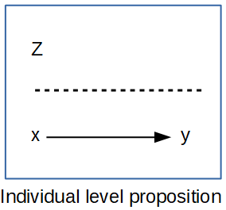
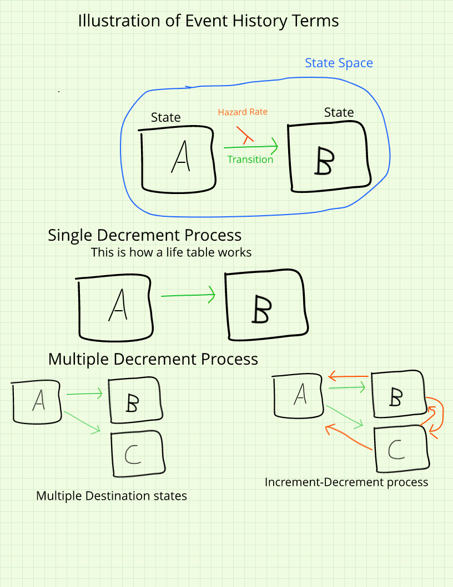
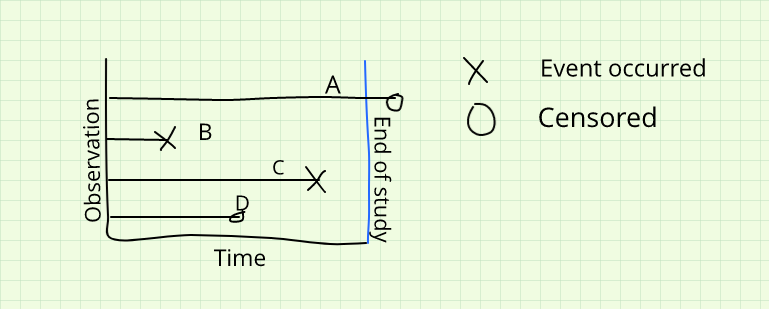
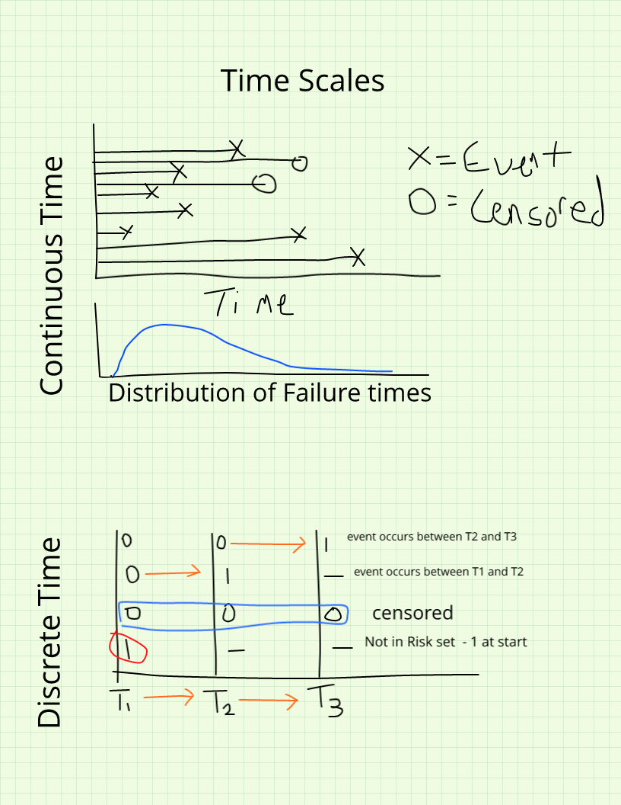

```{r, include=FALSE, message=FALSE}
rm(list=ls())
library(tidyverse, quietly = T)
library(ggplot2, quietly = T)
library(kableExtra, quietly = T)
theme_set(theme_classic())
```
\newpage

# Micro-demography

Demographic studies began to focus on individual level outcomes once the availability of individual level census and social/health survey data became more prevalent in the 1960's and 1970's. Corresponding with this availability of individual level data, demography began to be influenced by sociological thought, which brought a proper theoretical perspective to demographic studies, which, before this period were dominated by methodological issues and descriptions of macro scale demographic processes we saw in the previous chapter. 

This chapter focuses on how we model individual level observational data, with a focus on data from demographic surveys. In doing this, I focus on two primary goals, first to illustrate how to conduct commonly used regression analysis of demographic outcomes as measured in surveys, drawing heavily on data from the ******. Secondly, I describe the event-history framework that is used in much of social science when we analyze changes in outcomes between time points, or in describing the time to some demographic event, such as having a child or dying.

### Individual-level focus

In contrast to the macro-demographic perspective described in the previous chapter, the micro-demographic perspective is focused on the **individual** rather than the aggregate. Barbara Entwisle [-@entwisle_2007] explains, micro-demography focuses on how individuals are modeled within demographic studies, which focus on individual level behaviors and outcomes as a prime importance. Most of the time in an individual, or micro-demographic focus, our hypotheses are related to how the individual outcome or behavior is influenced by characteristics of the individual, usually without concern or interest in the physical or social context in which the individual lives their life. For instance, in a micro-demographic study of mortality, the researcher may make ask:
*Do individuals with a low level of education face higher risk of death, compared to people with a college education*
This in and of itself says nothing about the spatial context in which the person lives, it is only concerned with characteristics of the person. 

### Individual level propositions
If we are concerned with how individual-level factors affect each person's outcome, then we are stating an individual level, or micro, proposition. In this type of analysis, we have *y* and *x*, both measured on our individual level units. We may also have a variable *Z* measured on a second-level unit, but we'll wait and discuss these in the next chapter. An example of this micro-level, or individual level, proposition would be that we think a persons health is affected by their level of education. 


## Types of individual level outcomes
In the analysis of micro-demographic outcomes, we encounter a wide variety of outcomes. Some are relatively simple recoding of existing survey data, other times the outcomes depend on repeated measures of some behavior in a longitudinal framework. At the heart of different outcomes are different assumed statistical distributions used to model them, and the choices that we face related to which outcome best suits a particular outcome. Based on the Generalized Linear Model framework introduced in the previous chapter, in this chapter my goal is to illustrate how to use this framework for analyzing a variety of different types of outcomes. Also, I show how to use appropriate corrections for using complex survey data in the context of the various outcome types, relying heavily on the `survey` and `svyVGAM` packages [@lumley2004; @lumleysvyvgam]. 

### Continuous outcomes
The workhorse for continuous outcomes in statistics is the Gaussian, or Normal distribution linear model, which was reviewed in the previous chapter. The Normal distribution is incredibly flexible in its form, and once certain restrictions are removed via techniques such as generalized least squares, the model becomes even more flexible. I do not intend to go over the details of the model estimation in this chapter, as this was covered previously. Instead, I will use a common demographic survey data source, the Demographic and Health Survey model data to illustrate how to include survey design information and estimate the models. In addition to the Normal distribution, other continuous distributions including the Student-t and Gamma distributions are also relevant for modeling heteroskedastic and skewed continuous outcomes, as described in the previous chapters. 


## Event history framework

### When to conduct event history analysis

Event history analysis is the appropriate analytic strategy whenever your research question is fundamentally about time. More precisely, it applies when your question involves *when* something happens or *whether* it happens at all within some observation window. How long does it take for a couple to have a second child? Does a person diagnosed with a chronic illness develop a complication within five years? Does a migrant return to their origin country within the decade? If your research question cannot be framed in those terms — that is, if it does not involve a duration, a transition, or the timing of a change in state — then event history methods are probably not what you need.

This focus on time gives event history analysis a distinctly comparative character. We are rarely interested in the absolute duration of some process; instead, we compare durations and risks across groups defined by individual characteristics or social conditions. How long does a person with a college education survive relative to someone who did not finish high school? Is the risk of union dissolution higher in the first two years of marriage than at any subsequent point? The methods described in this chapter are designed precisely to answer questions of this form, framing comparison in terms of *relative risk* — the hazard of experiencing an event for one group relative to another.

### States, episodes, and the state space

Every event history analysis begins by defining the **state space**: the complete set of mutually exclusive and exhaustive conditions in which a study subject can exist at any given moment. A **state** is a discrete condition that an individual occupies — alive or dead, married or unmarried, employed or unemployed. The state space is the full set of alternatives. In the simplest and most common case, we have a two-state system, but more complex analyses may involve multiple origin and destination states; for example, a study of contraceptive use might distinguish among nonuse, traditional methods, and modern methods as separate states. When a subject moves from one state to another, that movement is called an **episode**, an **event**, or a **transition**. The time spent in a particular state is the **duration**, measured along a **time axis** that specifies the unit of measurement: days, months, years, or whatever scale is appropriate to the process under study.



### Censoring

One of the distinguishing features of event history data is **censoring**, which arises whenever we cannot directly observe the event for some subjects within the study period. Censoring is not a flaw in the data; it is an inherent feature of studying processes that may not have concluded by the time data collection ends, and the survival methods described here are explicitly designed to incorporate rather than discard censored observations.



**Non-informative censoring** occurs when a subject's observation ends simply because the study period ended — not because of anything particular about the subject. Their departure from the observation window is unrelated to their underlying risk of experiencing the event. This is the ideal form of censoring, and standard survival models require it to produce valid estimates. **Informative censoring**, by contrast, occurs when the reason a subject leaves the study is itself related to their risk. If the most severely ill patients in a clinical study are also the most likely to withdraw before the study ends, the censored cases differ systematically from those who remain, and standard models will produce biased estimates of the survival distribution. Identifying and addressing informative censoring is one of the more difficult practical challenges in event history analysis.

Beyond the informative or non-informative distinction, censoring can be characterized by its position in time relative to the event. **Right censoring** is by far the most common type: we know that the event had not yet occurred by the time the subject left our study, but we do not know whether or when it eventually occurred. **Left censoring** occurs when the event had already happened before the study began, so we know only that the duration was shorter than some threshold value. **Interval censoring** occurs when we know the event took place within some bounded window but cannot determine its precise timing. Right censoring is the easiest of the three to handle analytically, and nearly all of the models discussed in this chapter assume it.

### Time scales

Event history data also require a decision about how to measure duration itself. Under **continuous time**, durations are measured in precise units where each observation is, in principle, unique — the exact number of days from first marriage to first birth, or the number of miles until a mechanical component fails. Under **discrete time**, durations are measured in coarser intervals such as the semester in which a student withdraws from college or the calendar year of a death, and the same duration value may be shared by many subjects. The choice between continuous- and discrete-time methods is partly a function of the data at hand and partly a substantive decision about the process being modeled. When duration is genuinely measured on a continuous scale, Cox regression and related continuous-time methods are the natural choice. When the data are naturally discrete — or when ties are so pervasive that continuous-time methods become computationally awkward — discrete-time hazard models are often preferable. Both approaches are developed in detail later in this chapter.



When continuous-time data must be grouped into intervals for practical reasons, the grouping carries real costs. Any choice of interval boundary is inherently arbitrary, and different choices can lead to different substantive conclusions. Grouping discards information about variability within intervals, removes the ability to speak to mean or median durations, and can cause late-occurring events to be systematically undercounted. Wherever the data allow it, duration should be measured as finely as possible.

### Types of event history studies

The study design determines what kind of event history data you have and what analytic complications you will face. **Prospective** designs follow a cohort forward in time, recording events as they occur. These studies can capture the precise timing of transitions and are not subject to recall bias, but they are expensive, time-consuming, and vulnerable to attrition over the observation period. **Retrospective** designs interview respondents at a single point in time and ask them to reconstruct their histories: when did you last move? How many children have you had and when were they born? The Demographic and Health Surveys (DHS) use a retrospective design of this kind, collecting detailed birth histories for the five years preceding the interview. Retrospective data are considerably less costly to collect but are vulnerable to recall errors, particularly for events that occurred many years before the interview date.

A third important design is **record linkage**, in which researchers begin with an administrative record of some event — a birth certificate, a marriage registration, a hospital admission — and trace individuals through other record systems forward or backward in time. Historical demographers routinely link individual census records across decennial censuses, connecting births to marriages to deaths using name and place matching. Modern epidemiological studies link health surveys such as the National Health Interview Survey (NHIS) and the National Health and Nutrition Examination Survey (NHANES) to the National Death Index in order to study mortality outcomes. Record linkage creates large, cost-effective datasets but introduces its own complications in the form of match error and selection into the underlying administrative systems.


## Regression models for individual-level demographic outcomes

The workhorse of micro-demographic analysis is the regression model, and in most cases the outcomes we care about as demographers are not continuous variables that follow a nice bell curve. Instead, we tend to work with outcomes like whether someone died in the past year, whether a woman had a birth, whether a person migrated, or how many children someone has had over their lifetime. These outcomes are categorical or count-based, and they require us to reach beyond the familiar linear regression framework into the broader world of the **Generalized Linear Model**, or GLM.

The GLM framework [@nelder_generalized_1972] is one of the most important unifying ideas in applied statistics. At its core, a GLM does three things: it specifies a probability distribution for the outcome, it specifies a **link function** that connects the mean of that distribution to a linear combination of our predictors, and it estimates the model coefficients using maximum likelihood. The Normal distribution with the identity link is the special case we call ordinary linear regression, but once we recognize that our outcomes can follow many different distributions, the GLM becomes a tremendously flexible and extendable tool.

In this section, I walk through the most commonly used regression models for categorical and count outcomes in micro-demographic research, illustrating each one with data from the 2020 Behavioral Risk Factor Surveillance System (BRFSS) SMART Metro Area data, a nationally representative telephone survey conducted by the CDC that covers a wide range of health behaviors and outcomes [@cdc_brfss_2020]. The BRFSS is a natural choice for these examples because it contains exactly the kinds of outcomes demographers care about — health status, health behaviors, and their correlates — and because it has a complex survey design that we need to account for in our analysis.

### Binary outcomes and the logistic regression model

The most common outcome type in individual-level demographic research is the binary outcome: a variable coded 1 or 0 depending on whether some event or condition of interest occurred. Whether a person died, whether a woman gave birth, whether a person is in poor health, whether someone migrated — all of these can be represented as binary outcomes. When our outcome is binary, the appropriate distribution from the GLM family is the **Bernoulli distribution**, which is the special case of the binomial distribution where each individual either experiences the event or does not.

The fundamental challenge with binary outcomes is that we are trying to model a probability, $\pi = Pr(y=1)$, using a linear combination of predictors. Probabilities, by definition, are bounded between 0 and 1, while a linear combination of predictors can range from $-\infty$ to $\infty$. Simply fitting a linear regression to a binary outcome — a model sometimes called the **linear probability model** — can produce predicted probabilities outside the $[0,1]$ interval, which is not only mathematically awkward but substantively nonsensical. We need a way to map the unbounded linear predictor onto the bounded probability scale, and that is precisely what the link function does.

For the binary outcome, the standard link function is the **logit**, or log-odds transformation. The odds of an event are the probability of it occurring divided by the probability of it not occurring:

$$\text{odds}(\pi) = \frac{\pi}{1-\pi}$$

The odds are bounded on $[0, \infty)$, which is an improvement, but still not quite what we need. Taking the natural log of the odds transforms the quantity onto the real line:

$$\text{logit}(\pi) = \log\left(\frac{\pi}{1-\pi}\right)$$

and this log-odds can now be modeled as a linear function of our predictors:

$$\log\left(\frac{\pi}{1-\pi}\right) = \beta_0 + \beta_1 x_1 + \cdots + \beta_k x_k$$

This is the **logistic regression model**, and it is the most widely used regression model for binary outcomes in social science and public health research. Solving for the probability itself gives us the logistic function:

$$\pi = \frac{1}{1 + \exp(-(\beta_0 + \beta_1 x_1 + \cdots + \beta_k x_k))}$$

which is always bounded between 0 and 1 by construction — a nice property that falls out naturally from the model rather than having to be imposed from outside.

The **probit model** is an alternative specification that uses the inverse cumulative Normal distribution as its link function rather than the logit:

$$\Phi^{-1}(\pi) = \beta_0 + \beta_1 x_1 + \cdots + \beta_k x_k$$

where $\Phi^{-1}$ is the inverse of the standard Normal cumulative distribution function. In practice, the logistic and probit models produce very similar results, and the choice between them is often a matter of convention within a discipline rather than a matter of fit. The logistic regression model has the considerable practical advantage of producing **odds ratios** — the exponentiated coefficients — which are easy to interpret and widely understood in health and social science research. The probit model's coefficients are less immediately interpretable and typically require further transformation into marginal effects before they can be discussed in substantive terms. For these reasons, the logistic regression model is the default choice in most demographic applications.

#### Data preparation and survey design

For these examples, I load the 2020 BRFSS SMART MSA data and construct several demographic outcome and predictor variables. The outcome of primary interest is self-rated health, specifically whether a respondent reports poor or fair health, which serves as a well-established summary measure of overall health status. The predictors include race/ethnicity, educational attainment, and age group — a core set of sociodemographic characteristics that are consistently associated with health outcomes in the demographic and public health literature.

```{r, include=FALSE, message=FALSE}
library(car)
library(survey)
library(gtsummary)
library(sjPlot)
library(emmeans)
library(tidyverse)

brfss20 <- arrow::read_parquet("data/brfss20sm.parquet")
names(brfss20) <- tolower(gsub(pattern = "_", replacement = "", x = names(brfss20)))

# Poor or fair self-rated health (outcome)
brfss20$badhealth <- Recode(brfss20$genhlth, recodes = "4:5=1; 1:3=0; else=NA")

# Race/ethnicity
brfss20$race_eth <- Recode(brfss20$racegr3,
  recodes = "1='nhwhite'; 2='nh_black'; 3='nh_other'; 4='nh_multirace'; 5='hispanic'; else=NA",
  as.factor = TRUE)

# Education
brfss20$educ <- Recode(brfss20$educa,
  recodes = "1:2='0Prim'; 3='1somehs'; 4='2hsgrad'; 5='3somecol'; 6='4colgrad'; 9=NA",
  as.factor = TRUE)

# Age groups
brfss20$agec <- cut(brfss20$age80, breaks = c(0, 29, 39, 59, 79, 99))

# Survey design
sub <- brfss20 %>%
  dplyr::select(badhealth, race_eth, educ, agec, mmsawt, ststr) %>%
  filter(complete.cases(.))

options(survey.lonely.psu = "adjust")
des <- svydesign(ids = ~1,
                 strata = ~ststr,
                 weights = ~mmsawt,
                 data = sub)
```

#### Fitting the logistic regression model

To fit the logistic regression model to survey data in R, we use `svyglm()` from the `survey` package, specifying `family = binomial` to indicate the logistic link. This is essential when using complex survey data because ordinary `glm()` does not account for the stratification and weighting in the BRFSS design, which means that standard errors from an unweighted analysis will be too small and inference will be anticonservative.

```{r}
fit.logit <- svyglm(badhealth ~ race_eth + educ + agec,
                    design = des,
                    family = binomial)

fit.logit %>%
  tbl_regression(exponentiate = TRUE,
                 label = list(race_eth ~ "Race/Ethnicity",
                              educ ~ "Education",
                              agec ~ "Age Group"))
```

A useful visual summary of the odds ratios and their confidence intervals can be produced with `plot_model()` from the `sjPlot` package [@sjPlot]. In this plot, an odds ratio of 1 means no difference relative to the reference group; values above 1 indicate increased odds of poor or fair health, and values below 1 indicate decreased odds.

```{r}
plot_model(fit.logit,
           title = "Odds Ratios for Reporting Poor or Fair Self-Rated Health",
           show.values = TRUE,
           value.offset = 0.3)
```

#### Interpreting the odds ratios

The exponentiated coefficients from the logistic regression model are **odds ratios**, and they form the currency of interpretation in logistic regression. An odds ratio of 1.35 for a given group means that the odds of reporting poor or fair health are 35% higher for that group compared to the reference group, holding all other variables in the model constant. An odds ratio below 1 — say, 0.72 — means the odds are 28% lower than the reference group. In both cases, the percentage change is obtained by subtracting 1 from the odds ratio and multiplying by 100: $(\text{OR} - 1) \times 100$.

Looking at the BRFSS results, non-Hispanic Black respondents and Hispanic respondents have significantly higher odds of reporting poor or fair health compared to non-Hispanic white respondents, after accounting for education and age. The education gradient is pronounced and negative: each step up the educational ladder corresponds to meaningfully lower odds of reporting poor health, with college graduates having the lowest odds among all educational groups relative to those with only a primary school education. The age pattern runs in the expected direction as well, with older age groups reporting substantially higher odds of poor health than the youngest age group.

#### Predicted probabilities and marginal effects

Odds ratios are useful for assessing the statistical significance and direction of effects, but they can be difficult to communicate to non-technical audiences and difficult to interpret in absolute terms. A more intuitive way to convey the results is to compute **predicted probabilities** for specific types of individuals — what demographers sometimes call "interesting cases." The `emmeans` package [@emmeans] makes this straightforward by evaluating the model at specified combinations of predictor values and back-transforming the predictions from the log-odds scale to the probability scale.

```{r}
rg <- ref_grid(fit.logit)

marg <- emmeans(object = rg,
                specs = c("educ", "race_eth"),
                type = "response")

as.data.frame(marg) %>%
  ggplot(aes(x = educ, y = prob, color = race_eth, group = race_eth)) +
  geom_point(size = 2) +
  geom_line() +
  geom_errorbar(aes(ymin = asymp.LCL, ymax = asymp.UCL), width = 0.2) +
  labs(title = "Predicted Probability of Poor or Fair Self-Rated Health",
       subtitle = "By Education and Race/Ethnicity, BRFSS 2020",
       x = "Education",
       y = "Predicted Probability",
       color = "Race/Ethnicity",
       caption = "Source: CDC BRFSS SMART Data, 2020") +
  theme_minimal() +
  theme(axis.text.x = element_text(angle = 45, hjust = 1))
```

These predicted probabilities are often far more effective at telling the demographic story than odds ratios alone. The difference in predicted probability between a college-educated non-Hispanic white respondent and a respondent with a primary school education from a racial or ethnic minority group communicates the magnitude of the health disparity in a way that policy audiences and public health practitioners can immediately grasp. This is the move from statistical output to demographic interpretation — and it is usually the more important one.

### Ordinal outcomes and the proportional odds model

In many demographic surveys, the outcomes we are interested in do not fall neatly into a binary yes or no framework but instead take on ordered categorical responses. Self-rated health is a perfect example: the BRFSS asks respondents to rate their health as Excellent, Very Good, Good, Fair, or Poor. We could collapse this into the binary poor or fair versus good or better measure we used above, but doing so discards information — someone who says "Excellent" is meaningfully different from someone who says "Good," even though both would be coded 0 in the binary version.

When the outcome has **ordered categories**, the appropriate model is the **ordinal logistic regression model**, also called the **proportional odds model**. The logic is an extension of the binary logistic framework. Rather than modeling the log-odds of experiencing the event versus not, we model the *cumulative* log-odds of being in category $j$ or below versus being above category $j$, for each threshold $j$ in the response scale. Formally, if we have $J$ ordered categories, the proportional odds model is:

$$\log\left(\frac{Pr(Y \leq j)}{Pr(Y > j)}\right) = \beta_{0j} - x'\beta$$

where $\beta_{0j}$ is a category-specific intercept, called a **threshold** or **cutpoint**, that shifts with each level of $j$, and $\beta$ is a vector of covariate effects that is assumed to be the same across all transitions between adjacent categories. This last point is the **proportional odds assumption**: the relationship between the predictors and the log-odds of the cumulative outcome is the same regardless of which threshold you are considering. Think of it as fitting $J-1$ parallel logistic regression lines, one for each transition, with the same slopes but different intercepts.

This assumption is worth scrutinizing in practice. We can examine it informally by fitting a series of binary logistic regressions — one for each cumulative threshold — and comparing the coefficients. If the assumption holds, the slope estimates should be approximately the same across the $J-1$ binary models. If they vary substantially, a more flexible specification that relaxes the proportional odds constraint may be warranted. To fit the ordinal model to BRFSS data, I construct a three-level version of the general health variable (excellent or very good, good, fair or poor) and use `svyolr()` from the `survey` package.

```{r, message=FALSE, warning=FALSE}
library(VGAM)
library(svyVGAM)

brfss20$generalhealth <- Recode(brfss20$genhlth,
                                recodes = "1:2=1; 3=2; 4:5=3; else=NA",
                                as.factor = TRUE)
brfss20$generalhealth <- relevel(brfss20$generalhealth, ref = "1")

brfss20$healthnum <- car::Recode(brfss20$genhlth,
                                  recodes = "1:2=1; 3=2; 4:5=3; else=NA",
                                  as.factor = FALSE)

sub_ord <- brfss20 %>%
  dplyr::select(badhealth, healthnum, generalhealth, race_eth, educ, agec, mmsawt, ststr) %>%
  filter(complete.cases(.))

options(survey.lonely.psu = "adjust")
des_ord <- svydesign(ids = ~1,
                     strata = ~ststr,
                     weights = ~mmsawt,
                     data = sub_ord)

fit.olr <- svyolr(generalhealth ~ race_eth + educ + agec,
                  design = des_ord)

fit.olr %>%
  tbl_regression(exponentiate = TRUE)
```

#### Interpreting the proportional odds model

The exponentiated coefficients from the proportional odds model are also odds ratios, but their interpretation is slightly different from the binary case. Each odds ratio reflects the change in the odds of being in a higher health category — meaning a worse health category in this coding — for a one-unit change in the predictor. An odds ratio greater than 1 means the odds of reporting worse health increase; an odds ratio below 1 means the odds decrease.

In the BRFSS results, non-Hispanic white respondents have significantly lower odds of reporting worse health compared to Hispanic respondents across all category transitions, while the education gradient shows clearly that higher educational attainment is associated with lower odds of reporting worse health at every level of the scale. The ordinal model thus provides a richer picture of the health gradient across the full response distribution, rather than collapsing all of that information into a single binary threshold.

The decision to use an ordinal model rather than collapsing the outcome to a binary is always worth making deliberately. The ordinal model is more efficient — it uses all the information in the ordered response rather than discarding the distinctions within the two collapsed groups — and it often reveals patterns that a binary model obscures. For instance, the education gradient on health may be particularly pronounced at the extreme ends of the health distribution, distinguishing excellent from poor health, but weaker in the middle, distinguishing good from fair. Collapsing the outcome prevents you from seeing this. At the same time, the proportional odds assumption adds a constraint that may not hold in your data, and when it fails, a more flexible specification — such as the cumulative logit model with non-proportional odds available through the `svyVGAM` package [@lumleysvyvgam] — is worth considering.

### Multinomial outcomes

Sometimes the outcome of interest has multiple unordered categories, and neither the binary nor the ordinal model is appropriate. Consider the type of contraception a woman chooses, which labor market a migrant selects among several possible destinations, or the means of transportation a person uses to get to work. In each of these cases, the categories have no natural ordering that would make the proportional odds framework sensible. What we need instead is the **multinomial logistic regression model**.

The multinomial model is an extension of the binary logistic model to outcomes with $J$ unordered categories. We designate one category as the **reference level** and then estimate $J-1$ separate logistic regression equations, each comparing one category to the reference. For category $j$ compared to the reference category 1, the model takes the form:

$$\log\left(\frac{\pi_j}{\pi_1}\right) = x'\beta_j$$

where $\pi_j$ is the probability of being in category $j$ and $\beta_j$ is the vector of coefficients for that comparison. Because we estimate $J-1$ separate equations, we have $J-1$ sets of odds ratios to interpret — one set for each non-reference category versus the reference. This is necessarily more complex than the proportional odds model, and the results require more careful organization in the discussion.

In R, the multinomial model with survey design corrections requires the `svyVGAM` package, since there is no native survey-corrected multinomial function in the base `survey` package.

```{r, message=FALSE, warning=FALSE}
mfit <- svy_vglm(generalhealth ~ race_eth + educ + agec,
                 family = multinomial(refLevel = 1),
                 design = des_ord)

mfit %>%
  tbl_regression()
```

#### Interpreting the multinomial model

Each row in the multinomial output corresponds to one comparison: a particular category of the outcome versus the reference category, for each predictor level. For instance, the coefficient for non-Hispanic Black respondents in the equation for "fair or poor health versus excellent or very good health" tells you how the odds of reporting fair or poor health — rather than excellent or very good health — differ for Black respondents compared to the racial or ethnic reference group. The interpretation follows the same odds ratio logic as before, but you must keep track of which equation you are in when reading the output.

The multinomial model is an important tool when the categories of an outcome genuinely have no natural ordering, but it comes with real interpretive costs. The multiplication of equations means you have many more coefficients to report and explain, and it can be difficult for readers to see the overall pattern of effects across all the comparisons simultaneously. One useful strategy is to focus the narrative discussion on the predicted probabilities of being in each category for a set of interesting cases — specific combinations of predictor values that are substantively meaningful — rather than walking through each coefficient in isolation. This is precisely the spirit of the approach we used for the binary logistic model, and the `emmeans` package supports it for multinomial models as well.

### Count outcomes and the Poisson model

Demographers frequently work with outcomes that are not just binary or categorical but take the form of counts: the number of children a woman has had, the number of days of poor health in the past month, the number of hospitalizations in a year. Count data have two characteristics that make them inhospitable to linear regression. First, they are non-negative integers — you cannot have $-3$ children or $2.7$ hospitalizations. Second, their distribution is typically right-skewed, with many zeroes or small values and a long tail of larger ones. The appropriate distribution for counts is the **Poisson distribution**, and its GLM counterpart is the **Poisson regression model**, sometimes called a **log-linear model** because of the natural log link function it uses.

The Poisson model expresses the expected count $\lambda$ as a function of predictors through the log link:

$$\log(\lambda) = \beta_0 + \beta_1 x_1 + \cdots + \beta_k x_k$$

or equivalently:

$$\lambda = \exp(\beta_0 + \beta_1 x_1 + \cdots + \beta_k x_k)$$

The log link ensures that the predicted count is always non-negative, which respects the boundary constraint of the outcome. The interpretation of the model coefficients changes accordingly: rather than odds ratios, we compute **incidence rate ratios**, or IRRs, by exponentiating the coefficients. An IRR of 1.25 means the expected count is 25% higher for a one-unit increase in the predictor; an IRR of 0.80 means the expected count is 20% lower.

#### Rate models and offset terms

A particularly important application of the Poisson model in demographic research is the **rate model**, where we account for differences in population size or exposure time across observations. If we are modeling the number of deaths in counties, a county with 500,000 residents will almost certainly have more deaths than a county with 10,000 residents simply because it has more people — not because it is a more dangerous place to live. To make a fair comparison, we need to model the *rate* of deaths per person rather than the raw count. This is accomplished by including an **offset term** in the model: the natural log of the population size (or exposure time) is added to the linear predictor with a fixed coefficient of 1, effectively allowing us to model a rate rather than a count.

$$\log(\lambda) = \beta_0 + \beta_1 x_1 + \log(n)$$

which can be rewritten as:

$$\log\left(\frac{\lambda}{n}\right) = \beta_0 + \beta_1 x_1$$

In R, the offset is specified using the `offset()` function within the model formula, or as the `offset` argument to the model fitting function.

#### Overdispersion and the negative binomial model

The Poisson distribution has a restrictive property that causes problems in practice: its mean and variance are equal, both given by $\lambda$. Real count data often violate this assumption, with the variance substantially exceeding the mean — a condition called **overdispersion**. Overdispersion can arise from unobserved heterogeneity in the population not fully captured by the predictors, or from the clustering of events at the individual level. When overdispersion is present, a Poisson model will understate the standard errors of the coefficients, making the results appear more precise than they actually are.

The most common remedy is the **negative binomial model**, which introduces an additional dispersion parameter $\theta$ to accommodate variance greater than the mean. The variance of the negative binomial is $\lambda + \frac{\lambda^2}{\theta}$, which reduces to the Poisson as $\theta \to \infty$. In R, the `glm.nb()` function from the `MASS` package [@MASS] fits the negative binomial model; for survey data, the `quasipoisson` family in `svyglm()` serves as a pragmatic working correction for overdispersion.

```{r, message=FALSE, warning=FALSE}
library(MASS)

brfss_17 <- arrow::read_parquet("data/brfss_17.parquet")

brfss_17$healthdays <- Recode(brfss_17$physhlth, recodes = "88=0; 77=NA; 99=NA")
brfss_17$race_eth   <- Recode(brfss_17$racegr3,
  recodes = "1='nhwhite'; 2='nh_black'; 3='nh_other'; 4='nh_multirace'; 5='hispanic'; else=NA",
  as.factor = TRUE)
brfss_17$educ <- Recode(brfss_17$educa,
  recodes = "1:2='0Prim'; 3='1somehs'; 4='2hsgrad'; 5='3somecol'; 6='4colgrad'; 9=NA",
  as.factor = TRUE)
brfss_17$agec <- cut(brfss_17$age80, breaks = c(0, 29, 39, 59, 79, 99))

sub_cnt <- brfss_17 %>%
  dplyr::select(healthdays, race_eth, educ, agec, mmsawt, ststr) %>%
  filter(complete.cases(.))

options(survey.lonely.psu = "adjust")
des_cnt <- svydesign(ids = ~1,
                     strata = ~ststr,
                     weights = ~mmsawt,
                     data = sub_cnt)

fit.pois <- svyglm(healthdays ~ race_eth + educ + agec,
                   design = des_cnt,
                   family = quasipoisson)

fit.pois %>%
  tbl_regression(exponentiate = TRUE,
                 label = list(race_eth ~ "Race/Ethnicity",
                              educ ~ "Education",
                              agec ~ "Age Group"))
```

#### Interpreting count model results

The exponentiated coefficients from the Poisson model are interpreted as incidence rate ratios. In the BRFSS example modeling days of poor physical health, an IRR of 1.30 for a particular group means that group reports on average 30% more days of poor health per month than the reference group. An IRR of 0.75 indicates 25% fewer days. Like the odds ratio, the IRR is a multiplicative quantity rather than an additive one, which means the substantive magnitude of any given effect depends on the baseline count. A 30% increase from a baseline of 2 days is very different from a 30% increase from a baseline of 15 days, and it is worth reporting both the IRR and the implied absolute counts when communicating results to non-technical audiences.

The Poisson and negative binomial models are part of a larger family of count-data models that includes several refinements for specific situations demographers commonly encounter. When the outcome has a large excess of zeros beyond what the Poisson distribution would predict — for instance, when modeling the number of births in a sample that includes a substantial share of women who are not currently at risk of a birth — **zero-inflated models** can be used to model the excess zeros and the count process simultaneously. The hurdle model offers a related alternative. These extensions are beyond the scope of this chapter, but the reader interested in them will find accessible treatments in @long_regression_1997 and @hilbe_modeling_2011.

## Discrete-time event history models

Up to this point in the chapter we have been working with outcomes that are measured at a single point in time: a person either reports poor health or they do not, either falls into a given health category or they do not, either reports a certain number of days of illness or they do not. But a great deal of what demographers actually care about is not a state observed at a moment but an event that unfolds over time. When does a woman have her second child? When does an individual die? When does a married couple separate? These questions are inherently *temporal* — they ask not just whether something happens but when it happens — and the ordinary regression models we have discussed so far are not designed to answer them. For that we need the event history framework, which we introduced earlier in this chapter in the context of survival functions and hazard rates.

The event history framework comes in two broad flavors corresponding to how time itself is treated. In **continuous-time** models, such as the Cox proportional hazards model we discuss in the next section, the precise timing of events is used as the analytic currency. In **discrete-time** models, time is treated as occurring in meaningful, structured intervals — semesters, years, five-year periods — and the question at each interval is simply whether the event occurred or not. The discrete-time approach has a practical elegance that is easy to overlook at first glance: because the event is coded as a 1 or 0 in each time period, the discrete-time hazard model is, at its heart, nothing more than a logistic regression model applied to person-period data. This means you already know how to fit it.

### The logic of person-period data

The key conceptual move in the discrete-time framework is a transformation of how we think about our data. In the person-level format we are accustomed to, each row represents one individual, with columns recording their total duration at risk and whether they eventually experienced the event. In the **person-period** format, each row represents one person in one time period. A woman who was at risk of a second birth for four years and then had one would contribute four rows to the data — three with a 0 in the event column and one final row with a 1. A woman who was observed for six years and did not have a second birth would contribute six rows, all with 0s. This expansion of the data from one row per person to potentially many rows per person is what creates the structure we need to model the *period-specific* hazard — the conditional probability of the event occurring in each time interval, given that it has not yet occurred.

At each period $t$, the discrete-time hazard can be expressed as the simple ratio of failures to those at risk:

$$h(t) = \frac{\text{failures in period } t}{\text{individuals at risk in period } t}$$

This is the same logic as the life table's $q(x, n)$ probability of dying between exact ages $x$ and $x+n$. The discrete-time model generalizes this by introducing individual covariate effects on the period-specific hazard, and by modeling that hazard through the logit link function so that it remains bounded on the probability scale. The general form of the discrete-time hazard model is:

$$\text{logit}(h(t_{ij})) = \left[\alpha_1 D_1 + \alpha_2 D_2 + \cdots + \alpha_T D_T\right] + x'\beta$$

where $D_1, D_2, \ldots, D_T$ are indicator variables for each distinct risk period, the $\alpha_j$'s are the period-specific intercepts that trace out the shape of the baseline log-odds hazard over time, and the $\beta$'s are the covariate effects. Notice that the period indicators take the place of a single intercept: we suppress the global intercept and let each time period have its own, which gives us the **general form model** — so called because it places no constraints on the shape of the hazard over time.

The covariate effects $\beta$ in this model have the same interpretive logic as in the ordinary logistic regression model: they represent shifts in the log-odds of the event occurring, assumed to be constant across all time periods. Exponentiating them yields **odds ratios** for the period-specific hazard. This proportionality assumption — that the covariates shift the entire baseline hazard by a constant multiplicative factor at every time period — is formally equivalent to the proportional hazards assumption we will encounter again in the Cox model. The **complementary log-log** link function, $\log(-\log(1-h(t)))$, is an alternative to the logit that makes this connection even more explicit, because the hazard ratios from a complementary log-log discrete-time model are equivalent to the hazard ratios from a continuous-time proportional hazards model applied to the same data. I use the complementary log-log link in the examples below for this reason.

To make the data transformation concrete, it helps to see the three standard arrangements for event history data side by side. The counting process format records aggregate failures and risk sets within each time interval — the familiar structure of the cohort life table. Case-duration data record one row per individual with a total observed duration and an event indicator; this is the natural starting point for continuous-time survival analysis. Person-period data record one row per individual per risk period, with the event indicator set to 1 only in the final row for cases that experience the event. The relationship among these three representations is not merely organizational: the counting process format shows what happened to the group, the case-duration format shows what happened to each person, and the person-period format shows what each person experienced in each discrete interval. It is the third format that discrete-time hazard models require, and the code in the next section shows how to construct it from case-duration data in R.

```{r, echo=FALSE, message=FALSE}
library(kableExtra)
t1_demo <- data.frame(
  Time_start = c(1, 2, 3, 4),
  Time_end   = c(2, 3, 4, 5),
  Failing    = c(25, 15, 12, 20),
  At_Risk    = c(100, 75, 60, 40)
)
t1_demo %>%
  kable(col.names = c("Interval start", "Interval end", "Failures", "At risk"),
        caption = "Counting process format: aggregate failures and risk sets by interval") %>%
  column_spec(1:4, border_left = TRUE, border_right = TRUE) %>%
  kable_styling()
```

```{r, echo=FALSE, message=FALSE}
t2_demo <- data.frame(
  ID             = c(1, 2, 3, 4),
  Duration       = c(5, 2, 9, 6),
  Event_Occurred = c("Yes (1)", "Yes (1)", "No (0)", "Yes (1)")
)
t2_demo %>%
  kable(col.names = c("ID", "Duration", "Event occurred"),
        caption = "Case-duration format: one row per individual") %>%
  column_spec(1:3, border_left = TRUE, border_right = TRUE) %>%
  kable_styling(position = "center")
```

```{r, echo=FALSE, message=FALSE}
t3_demo <- data.frame(
  ID     = c(rep(1, 5), rep(2, 2), rep(3, 9), rep(4, 6)),
  Period = c(seq(1, 5), seq(1, 2), seq(1, 9), seq(1, 6)),
  Event  = c(0, 0, 0, 0, 1,  0, 1,  0, 0, 0, 0, 0, 0, 0, 0,  0, 0, 0, 0, 0, 0, 0)
)
t3_demo %>%
  kable(col.names = c("ID", "Period", "Event"),
        caption = "Person-period format: one row per individual per risk period") %>%
  column_spec(1:3, border_left = TRUE, border_right = TRUE) %>%
  kable_styling(position = "center")
```

### Constructing the person-period file in R

The `survSplit()` function from the `survival` package [@survival-package] is the workhorse for converting case-duration data into person-period format in R. It takes the continuous duration variable, a vector of cutpoints defining the discrete time intervals, and an event indicator, and returns the expanded dataset with one row per person per risk period.

For this example, I use the DHS individual recode file and model the birth interval between a woman's first and second birth — one of the most studied transitions in demographic research. Women who had a first birth but had not had a second birth by the time of the survey are right-censored. The natural unit of time for this outcome is years, and I use annual intervals beginning immediately after the first birth.

```{r, message=FALSE, warning=FALSE}
library(survival)
library(haven)
library(survey)
library(tidyverse)
library(car)

dat <- arrow::read_parquet("data/ZZIR62FL.parquet")

# Select women at risk of a second birth: had a first birth, non-twin
sub <- dat %>%
  filter(bidx_01 == 1 & b0_01 == 0) %>%
  transmute(
    CASEID    = caseid,
    int.cmc   = v008,
    fbir.cmc  = b3_01,
    sbir.cmc  = b3_02,
    educ      = v106,
    age       = v012,
    agec      = cut(v012, breaks = seq(15, 50, 5), include.lowest = TRUE),
    rural     = v025,
    weight    = v005 / 1000000,
    psu       = v021,
    strata    = v022
  ) %>%
  mutate(
    agefb  = age - (int.cmc - fbir.cmc) / 12,
    # Duration: months between first birth and second birth (or interview if censored)
    secbi  = ifelse(is.na(sbir.cmc), int.cmc - fbir.cmc, fbir.cmc - sbir.cmc),
    b2event = ifelse(is.na(sbir.cmc), 0, 1)
  ) %>%
  filter(secbi > 0)

# Expand to person-period format: annual intervals up to 20 years
pp <- survSplit(Surv(secbi, b2event) ~ .,
                data    = sub,
                cut     = seq(0, 240, 12),
                episode = "year_birth")

pp$year <- pp$year_birth - 1
pp      <- pp[order(pp$CASEID, pp$year_birth), ]
```

The resulting dataset has one row per woman per year of risk. A woman who had her second birth in the third year after her first would appear three times in the data, with a 0 for the first two years and a 1 in the third. This is the person-period structure the model requires.

### Descriptive analysis of the hazard

Before fitting any model, it is always worth plotting the raw hazard estimates — the simple proportion of women who had a second birth in each year among those who were still at risk. This gives us a direct empirical picture of the shape of the hazard over time, which informs both the model we choose and how we parameterize time within it.

```{r}
pp %>%
  group_by(year) %>%
  summarise(prop_birth = mean(b2event, na.rm = TRUE)) %>%
  ggplot(aes(x = year, y = prop_birth)) +
  geom_line() +
  geom_point(size = 1.5) +
  labs(
    title   = "Empirical Discrete-Time Hazard of Second Birth",
    subtitle = "By year since first birth, DHS Model Data",
    x       = "Years since first birth",
    y       = "Hazard h(t)",
    caption = "Source: DHS Model Data"
  ) +
  theme_minimal()
```

We can also disaggregate by a covariate of interest — here, maternal education — to get a preliminary sense of whether and how the hazard differs across groups.

```{r}
pp %>%
  group_by(year, educ) %>%
  summarise(prop_birth = mean(b2event, na.rm = TRUE), .groups = "drop") %>%
  ggplot(aes(x = year, y = prop_birth,
             color = factor(educ), group = factor(educ))) +
  geom_line() +
  labs(
    title   = "Hazard of Second Birth by Maternal Education",
    subtitle = "By year since first birth, DHS Model Data",
    x       = "Years since first birth",
    y       = "Hazard h(t)",
    color   = "Education level",
    caption = "Source: DHS Model Data"
  ) +
  theme_minimal()
```

### Fitting the discrete-time hazard model

To fit the model, we set up the survey design on the expanded person-period dataset and then call `svyglm()` exactly as we would for an ordinary logistic regression, with two important additions: we suppress the global intercept with `-1` in the formula so that each time period gets its own intercept, and we specify the `cloglog` link to preserve the proportional hazards interpretation of the covariate effects.

```{r}
options(survey.lonely.psu = "adjust")
des <- svydesign(ids     = ~psu,
                 strata  = ~strata,
                 weights = ~weight,
                 data    = pp)

# General form: one intercept per time period, no covariates
fit.0 <- svyglm(b2event ~ as.factor(year) - 1,
                design = des,
                family = binomial(link = "cloglog"))

# General form with education covariate
fit.1 <- svyglm(b2event ~ as.factor(year) + factor(educ) - 1,
                design = des,
                family = binomial(link = "cloglog"))

summary(fit.1)
```

The period-specific intercepts from the baseline model (`fit.0`) can be converted to probabilities and plotted to recover the model-implied hazard function, which should closely track the empirical hazard we plotted above. The covariate model (`fit.1`) adds the education effect on top of those period-specific intercepts.

```{r}
# Plot the model-implied baseline hazard
haz  <- 1 - exp(-exp(coef(fit.0)))
time <- seq_along(haz)

data.frame(time = time, hazard = haz) %>%
  ggplot(aes(x = time, y = hazard)) +
  geom_line() +
  labs(
    title   = "Model-Implied Discrete-Time Hazard Function",
    subtitle = "General form model, second birth interval",
    x       = "Years since first birth",
    y       = "h(t)"
  ) +
  theme_minimal()
```

### Interpreting the model

The covariate effects in the discrete-time hazard model are interpreted as they would be in any logistic regression with a complementary log-log link: exponentiating the coefficient gives a **hazard ratio** that is directly comparable to the hazard ratios from a Cox model. In the DHS second-birth example, a negative coefficient on education means that more educated women face a lower hazard of having a second birth in any given year after their first, holding the time period constant. The hazard ratio $\exp(\hat{\beta})$ gives the multiplicative factor by which the hazard for a given education group differs from the reference group at any point in the follow-up. The percentage difference is $(\exp(\hat{\beta}) - 1) \times 100$.

```{r}
# Hazard ratios for education
round(exp(coef(fit.1)[grepl("educ", names(coef(fit.1)))]), 3)
```

We can also generate predicted hazard functions for different types of women by evaluating the model at specified covariate values, which gives a direct visual representation of how education modifies the timing and probability of a second birth.

```{r}
dat_pred <- expand.grid(year = 1:20, educ = c(0, 1, 2, 3))
dat_pred$hazard <- as.numeric(predict(fit.1, newdata = dat_pred, type = "response"))

dat_pred %>%
  ggplot(aes(x = year, y = hazard,
             color = factor(educ), group = factor(educ))) +
  geom_line() +
  labs(
    title   = "Predicted Hazard of Second Birth by Maternal Education",
    x       = "Years since first birth",
    y       = "Predicted h(t)",
    color   = "Education level",
    caption = "Source: DHS Model Data"
  ) +
  theme_minimal()
```

### Discussion: alternative time parameterizations

One of the appealing features of the discrete-time framework is its flexibility in how time is specified in the model. The general form model we have been using estimates a separate hazard for every observed time period, which gives maximum flexibility but can produce erratic estimates if the number of events at certain time points is small. A more parsimonious approach is to specify time as a continuous variable — linear, quadratic, or higher-order polynomial — or to use a natural spline function of time that can capture smooth nonlinearity without committing to a specific polynomial form.

```{r}
#| eval: false
library(splines)

fit.lin  <- svyglm(b2event ~ year,
                   design = des, family = binomial(link = "cloglog"))
fit.quad <- svyglm(b2event ~ year + I(year^2),
                   design = des, family = binomial(link = "cloglog"))
fit.sp   <- svyglm(b2event ~ ns(year, df = 3),
                   design = des, family = binomial(link = "cloglog"))
```

We compare the fit of these alternative time specifications using AIC. In general, the general form model will have the lowest AIC because it is the most flexible, but the gain in parsimony from a spline or polynomial specification is often worth the modest penalty in fit, especially when the number of distinct time periods is large.

```{r}
#| eval: false
aic_tab <- data.frame(
  Model    = c("General form", "Linear time", "Quadratic time", "Natural spline"),
  AIC      = c(AIC(fit.0), AIC(fit.lin), AIC(fit.quad), AIC(fit.sp)),
  stringsAsFactors = FALSE
)
aic_tab$Delta_AIC <- round(aic_tab$AIC - min(aic_tab$AIC), 2)
aic_tab$AIC       <- round(aic_tab$AIC, 2)

knitr::kable(aic_tab,
             caption = "AIC comparison for alternative time specifications in the discrete-time model",
             col.names = c("Model", "AIC", "\u0394AIC"))
```

The survival function corresponding to the discrete-time hazard can be recovered from the product-limit estimator applied to the model-predicted hazards:

$$S(t) = \prod_{j=1}^{t} (1 - h_j)$$

which accumulates the probability of *not* experiencing the event across all periods up to and including $t$. This gives us the model-based survival curve, directly analogous to the Kaplan-Meier estimator but now conditioned on the covariates in the model.

The discrete-time model is a natural starting point for event history analysis in many demographic applications precisely because it leverages tools — logistic regression, survey design corrections, predicted probabilities — that the analyst already has in their toolkit. Its principal limitation is the requirement that time be measured in meaningful discrete units, and when the underlying process is genuinely continuous and the data record exact timings, the continuous-time Cox model discussed in the next section will typically be both more efficient and more natural.

## Functions of survival time

Before fitting the Cox model, it is worth pausing to establish the mathematical language that unifies the life table, the discrete-time hazard model, and the Cox model into a coherent framework. The distribution of survival times can be described completely by three interrelated functions, and understanding their relationships pays dividends when interpreting model output.

The **cumulative distribution function** $F(t)$ gives the probability that the event has already occurred by time $t$:

$$F(t) = \int_{0}^{t} f(u)\, du = \Pr(T \leqslant t)$$

Its complement is the **survivorship function** $S(t)$, the probability that the event has not yet occurred by time $t$:

$$S(t) = 1 - F(t) = \Pr(T \geqslant t)$$

By construction $S(0) = 1$ and $S(\infty) = 0$; the function is monotonically non-increasing over time. The **probability density function** $f(t)$ gives the unconditional instantaneous rate of failure in the interval $(t, t + \Delta t)$ per unit time:

$$f(t) = F'(t) = \lim_{\Delta t \rightarrow 0} \frac{F(t + \Delta t) - F(t)}{\Delta t}$$

Because $S(t) = 1 - F(t)$, this is equivalently written as $f(t) = -S'(t)$.

The **hazard function** $h(t)$ captures what we most want to know: the instantaneous risk of the event occurring at time $t$, *conditional on having survived to that point*:

$$h(t) = \frac{f(t)}{S(t)} = \lim_{\Delta t \rightarrow 0} \frac{\Pr(t \leqslant T \leqslant t + \Delta t \mid T \geqslant t)}{\Delta t}$$

The conditioning on $T \geqslant t$ is what distinguishes the hazard from a simple probability density. It makes the hazard a conditional rate, and this property is what makes it the natural language for studying how individual characteristics affect the timing of demographic events. The figure below illustrates all three functions simultaneously for a hypothetical log-normal survival distribution.

```{r}
#| label: fig-survfunctions
#| fig-cap: "The three functions of survival time — cumulative distribution F(t) in black, survivorship S(t) in red, and hazard h(t) in green — for a log-normal distribution parameterized to approximate human mortality with a mean log-duration of 4.32."
Ft <- cumsum(dlnorm(x = seq(0, 110, 1), meanlog = 4.317488, sdlog = 2.5))
ft <- diff(Ft)
St <- 1 - Ft
ht <- ft / St[1:110]
plot(Ft, ylim = c(0, 1), xlab = "Time", ylab = "Probability",
     type = "l", main = "Functions of survival time")
lines(St, col = "red")
lines(ht, col = "green")
legend("right", legend = c("F(t)", "S(t)", "h(t)"),
       col = c("black", "red", "green"), lty = 1)
```

Empirically, $S(t)$ takes the form of a step function that drops at each observed event time. The code below constructs such a step function from a simple counting process table, illustrating the product-limit logic that underlies the Kaplan-Meier estimator:

```{r}
t1_surv <- data.frame(Time_start = c(1, 2, 3, 4),
                      Time_end   = c(2, 3, 4, 5),
                      Failing    = c(25, 15, 12, 20),
                      At_Risk    = c(100, 75, 60, 40))
St_step <- c(1, cumprod(1 - (t1_surv$Failing / t1_surv$At_Risk)))
plot(St_step, type = "s", xlab = "Time", ylab = "S(t)", ylim = c(0, 1),
     main = "Empirical survivorship function")
```

The three functions are mathematically interchangeable: given any one, the others can be recovered. Writing $h(t) = -d\log S(t)/dt$ and integrating with $S(0) = 1$ yields:

$$S(t) = \exp\!\left(-\int_{0}^{t} h(u)\, du\right) = e^{-H(t)}$$

where $H(t) = \int_{0}^{t} h(u)\, du$ is the **cumulative hazard function**, with the convenient property that $H(t) = -\log S(t)$. The density can then be written as $f(t) = h(t)\, e^{-H(t)}$. Extending the hazard to condition on a vector of individual-level covariates $x$ gives:

$$h(t \mid x) = \lim_{\Delta t \rightarrow 0} \frac{\Pr(t \leqslant T \leqslant t + \Delta t \mid T \geqslant t,\, x)}{\Delta t}$$

This covariate-conditional hazard is the direct starting point for the Cox proportional hazards model, to which we now turn.

## The Cox proportional hazards model

When we modeled the second birth interval in the previous section, we made a choice that is easy to overlook: we collapsed the continuous month-by-month duration data into annual intervals. This was a reasonable practical decision, but it is a decision nonetheless, and it discards information. A woman who had her second birth in month 13 and a woman who had it in month 23 both contribute a "1" to the same annual risk period in the person-period file, even though their experiences were meaningfully different. When we have access to precise event times — which the DHS provides in the form of century month codes — we should use them. The Cox proportional hazards model is designed to do exactly that.

The Cox model, proposed by Sir David Cox in a landmark 1972 paper [@cox_regression_1972], is the most widely used survival model in social science and public health research. Its central appeal is what Cox himself recognized as both the problem with and the solution to parametric hazard modeling: when you specify a parametric distribution for the baseline hazard — exponential, Weibull, log-normal — you are forcing your data to conform to that shape whether it actually does or not. If you guess wrong, every inference downstream is contaminated by the misspecification. Cox's insight was that in most research situations we care about the effects of covariates on the hazard much more than we care about the exact shape of the baseline hazard, and we can estimate those covariate effects without ever specifying what the baseline hazard looks like. This makes the Cox model what statisticians call a **semi-parametric** model: the covariate effects $\beta$ are estimated parametrically in the usual maximum likelihood sense, but the baseline hazard $h_0(t)$ is left entirely unspecified.

### Model form

The Cox proportional hazards model takes the form:

$$h(t \mid x) = h_0(t) \exp(x'\beta)$$

where $h_0(t)$ is the **baseline hazard** — the hazard for an individual with all covariates equal to zero — and $\exp(x'\beta)$ is the multiplicative factor by which a particular individual's covariate vector shifts that baseline hazard up or down. The baseline hazard is a function of time alone, and the covariate effects operate on it multiplicatively and proportionally: for any two individuals $i$ and $j$ with covariate vectors $x_i$ and $x_j$, their hazard ratio at any time $t$ is:

$$\frac{h_i(t)}{h_j(t)} = \frac{h_0(t)\exp(x_i'\beta)}{h_0(t)\exp(x_j'\beta)} = \exp\left((x_i - x_j)'\beta\right)$$

The baseline hazard cancels out of the ratio entirely, which is both the practical magic of the Cox model and the source of its name: the hazards are **proportional** to each other at all times, with a ratio that depends only on the covariates and not on the time of observation. For a single binary covariate, the hazard ratio simplifies to $\exp(\beta)$, where $\beta$ is the log hazard ratio for individuals with $x = 1$ compared to those with $x = 0$.

### Partial likelihood estimation

If the baseline hazard $h_0(t)$ is unspecified, how do we estimate the covariate effects? Cox's solution was to construct a **partial likelihood** that extracts all the information about $\beta$ from the ordering of failure times, without requiring any statement about the shape of $h_0(t)$. The idea is elegant: at each observed failure time $t_j$, we ask — given that *someone* in the risk set failed at this moment, what is the probability it was the particular individual $j$ who actually did fail? That probability is:

$$Pr(j \text{ fails at } t_j \mid \text{one failure at } t_j) = \frac{\exp(x_j'\beta)}{\sum_{k \in R(t_j)} \exp(x_k'\beta)}$$

where $R(t_j)$ is the **risk set** at time $t_j$ — the set of all individuals who have not yet experienced the event and are not yet censored at that moment. The partial likelihood is the product of these probabilities over all observed failure times:

$$L_p(\beta) = \prod_{j:\delta_j=1} \frac{\exp(x_j'\beta)}{\sum_{k \in R(t_j)} \exp(x_k'\beta)}$$

Notice that $h_0(t)$ never appears in this expression — it cancels in the numerator and denominator at every failure time. Maximizing $L_p(\beta)$ with respect to $\beta$ gives the **maximum partial likelihood estimates**, which Cox and subsequent researchers showed have the same large-sample properties as ordinary maximum likelihood estimates, including asymptotic normality and the ability to use Wald tests and likelihood ratio tests for inference.

When tied event times occur — and they occur constantly in demographic work, because our data often record time in months or years rather than exact days — the partial likelihood must be modified to handle the ambiguity in the risk set ordering. The most widely used modification is **Efron's method** [@efron_efficiency_1977], which considers all possible orderings of the tied observations when constructing the risk set at each tied failure time. This is the default in most software and should be preferred over the simpler Breslow approximation when there are many ties, as is common with demographic data measured in coarse time units.

### Data preparation and fitting the model

Returning to the DHS second-birth example, I now fit the Cox model to the original case-duration data — one row per woman, with the duration between first and second birth recorded in months — rather than the expanded person-period file used in the discrete-time analysis. The key new element in R is the `Surv()` object from the `survival` package [@survival-package], which packages the duration and censoring indicator together into the outcome that `svycoxph()` expects. For survey data, `svycoxph()` from the `survey` package provides survey-corrected standard errors.

```{r, message=FALSE, warning=FALSE}
library(survival)
library(haven)
library(survey)
library(tidyverse)
library(car)

#
sub <- dat %>%
  filter(bidx_01 == 1 & b0_01 == 0) %>%
  transmute(
    CASEID       = caseid,
    int.cmc      = v008,
    fbir.cmc     = b3_01,
    sbir.cmc     = b3_02,
    educ         = v106,
    age          = v012,
    agec         = cut(v012, breaks = seq(15, 50, 5), include.lowest = TRUE),
    rural        = v025,
    partneredu   = v701,
    weight       = v005 / 1000000,
    psu          = v021,
    strata       = v022
  ) %>%
  mutate(
    agefb   = age - (int.cmc - fbir.cmc) / 12,
    secbi   = ifelse(is.na(sbir.cmc), int.cmc - fbir.cmc, fbir.cmc - sbir.cmc),
    b2event = ifelse(is.na(sbir.cmc), 0, 1),
    # Predictor variables
    educ.high      = ifelse(educ %in% c(2, 3), 1, 0),
    age2           = agefb^2,
    partnerhiedu   = ifelse(partneredu < 3, 0,
                     ifelse(partneredu %in% c(8, 9), NA, 1))
  ) %>%
  filter(secbi > 0, complete.cases(secbi, b2event, educ.high, agefb, partnerhiedu))

options(survey.lonely.psu = "adjust")
des <- svydesign(ids     = ~psu,
                 strata  = ~strata,
                 weights = ~weight,
                 data    = sub)

cox.fit <- svycoxph(Surv(secbi, b2event) ~ educ.high + partnerhiedu + agefb + age2,
                    design = des)

summary(cox.fit)
```

The `summary()` output reports the estimated coefficients on the log-hazard scale, their standard errors, Wald test statistics, and — most usefully — the exponentiated coefficients as **hazard ratios** with 95% confidence intervals. These are the quantities we interpret. A clean table can be produced with `tbl_regression()`:

```{r}
library(gtsummary)
cox.fit %>%
  tbl_regression(
    exponentiate = TRUE,
    label = list(
      educ.high    ~ "Secondary education or higher",
      partnerhiedu ~ "Partner secondary education or higher",
      agefb        ~ "Age at first birth",
      age2         ~ "Age at first birth (squared)"
    )
  )
```

### Interpreting hazard ratios

The hazard ratio is the fundamental quantity of interpretation in the Cox model, and it has a clean and intuitive meaning: it expresses the multiplicative difference in the *instantaneous risk* of experiencing the event between two groups, at any moment in time. An exponentiated coefficient of $\exp(\hat{\beta}) = 0.72$ for secondary education or higher means that women who completed secondary school or above face a hazard of having a second birth that is 28% *lower* at every moment in time, compared to women with less than secondary education, holding age and partner education constant. The percentage change is $(\exp(\hat{\beta}) - 1) \times 100$: for a hazard ratio of 0.72, that is $(0.72 - 1) \times 100 = -28\%$.

An important interpretive note: the hazard ratio describes the instantaneous risk differential, not the probability of an event occurring over a specific time window. A woman with a hazard ratio of 0.72 is not 28% less likely to *ever* have a second birth — she simply faces 28% lower risk at every moment. What the hazard ratio implies about the probability of an event over a fixed period depends on the shape of the baseline hazard $h_0(t)$, which the Cox model does not estimate directly.

#### Discussion

The inclusion of both age at first birth (`agefb`) and its square (`age2`) in the model reflects a common and important feature of demographic outcomes: many risks are nonlinear in age. A woman's hazard of a second birth typically rises after her first birth, peaks somewhere in the childbearing years, and then declines as she approaches the end of her reproductive period. A linear age term would force a monotone relationship, which may not fit the data well. Checking whether a continuous covariate needs to be entered as a quadratic — or even more flexibly as a spline — is a standard part of model specification, and the martingale residuals we discuss below are a diagnostic tool for exactly this question.

### Visualizing the model: survival and hazard curves

One of the most effective ways to communicate Cox model results to a substantive audience is to plot the predicted survival or hazard functions for a set of interesting, contrasting cases — what the model implies about the timing of the second birth for, say, a highly educated woman in her mid-twenties versus a woman with no secondary education in her early thirties. The `survfit()` function applied to a fitted Cox model generates these curves by evaluating the product-limit estimator on the baseline hazard and then adjusting it by the risk score of the specified individual.

```{r}
# Predicted survival curves for contrasting types of women
newdat <- data.frame(
  educ.high    = c(1, 0),
  partnerhiedu = c(1, 0),
  agefb        = c(25, 32),
  age2         = c(25^2, 32^2)
)

# svycoxph does not support survfit with newdata; refit with coxph on the
# underlying data (using survey weights) solely for curve generation.
# Coefficients are identical; only standard errors differ.
cox.fit.plot <- coxph(Surv(secbi, b2event) ~ educ.high + partnerhiedu + agefb + age2,
                      data = sub, weights = weight)
fit_curves <- survfit(cox.fit.plot, newdata = newdat)

plot(fit_curves,
     col      = c("steelblue", "firebrick"),
     lty      = 1,
     xlab     = "Months since first birth",
     ylab     = "S(t) — Probability of not yet having second birth",
     main     = "Cox Model: Predicted Survival for Second Birth Interval",
     xlim     = c(0, 120))

legend("topright",
       legend = c("Highly educated, age 25", "Low education, age 32"),
       col    = c("steelblue", "firebrick"),
       lty    = 1,
       bty    = "n")
```

The gap between these survival curves at any point on the time axis directly visualizes the hazard ratio: the more steeply a curve declines, the higher the hazard of a second birth for that type of woman in that period.

### The proportional hazards assumption

The Cox model rests on one central assumption: the hazard ratio between any two individuals is constant over time. This is the **proportional hazards assumption**, and it is the price we pay for the model's attractive semi-parametric flexibility. If a covariate's effect on the hazard is genuinely time-varying — if, say, the education gradient on second birth risk is large early in the birth interval but narrows later as biological pressures become more dominant than socioeconomic ones — then the Cox model will average over that time-varying effect and may produce misleading estimates.

The standard diagnostic for this assumption uses **Schoenfeld residuals**, proposed by @grambsch_proportional_1994. At each observed failure time, the Schoenfeld residual for a covariate is the difference between the observed value of that covariate for the person who failed and its expected value given the risk set at that time. If the proportional hazards assumption holds, these residuals should show no systematic trend over time: they should scatter randomly around zero regardless of where in the follow-up period we look. A significant correlation between the Schoenfeld residuals and time is evidence of non-proportionality.

In R, the `cox.zph()` function from the `survival` package performs this test and produces the associated plot:

```{r}
# Test and plot the proportional hazards assumption
fit.zph <- cox.zph(cox.fit)
fit.zph

plot(fit.zph, df = 2)
```

When reading this output, we do not want to see significant p-values — a significant result here is the bad news, indicating that the covariate's effect is changing over time. If all p-values and the global test are non-significant, we have no evidence against the proportional hazards assumption and can proceed with confidence.

**Martingale residuals** serve a different diagnostic purpose: they help us assess whether the functional form of a continuous covariate has been correctly specified. The martingale residual for individual $i$ is:

$$M_i = \delta_i - \hat{H}_i(t)$$

where $\delta_i$ is the event indicator and $\hat{H}_i(t)$ is the estimated cumulative hazard. Plotting these residuals against the values of a continuous covariate, with a smooth curve fitted through the cloud, reveals whether the covariate is entering the model linearly as assumed, or whether a nonlinear transformation — a quadratic term or a spline — is needed.

```{r, message=FALSE, warning=FALSE}
# Martingale residuals for age at first birth
res.mar <- resid(cox.fit, type = "martingale")

scatter.smooth(des$variables$agefb,
               res.mar,
               degree  = 2,
               span    = 1,
               ylab    = "Martingale Residual",
               xlab    = "Age at first birth",
               col     = "gray50",
               cex     = 0.4,
               lpars   = list(col = "firebrick", lwd = 2.5))
title(main = "Martingale Residuals for Age at First Birth