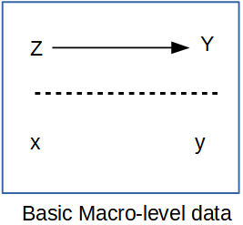

\newpage

```{python, include=FALSE}
import warnings
warnings.filterwarnings("ignore")
import numpy as np
import pandas as pd
import plotnine as p9
from plotnine import (
    ggplot, aes, geom_histogram, geom_bar, geom_point, geom_line,
    geom_sf, coord_sf, facet_wrap, labs, xlab, ylab, ggtitle,
    scale_fill_continuous, scale_color_discrete, theme, element_text,
    theme_classic
)
p9.theme_set(theme_classic())
```

# Macro demographic data analysis

Prior to the advent in the 1960's of large scale social surveys like the General Social Survey (GSS), most demographic research was done not on individuals but on aggregates, because that's how data were available. If you look at texts such as @keyfitz_introduction_1968, all of the examples are for national level calculations, and many nations did not have sufficient data availability to produce quality statistical summaries of their populations, resulting in publications such as the United Nations Population Division's famous Manual X [-@united_nations_population_division_manual_1983], which gave pragmatic formulas to measure a wide variety of demographic indicators at the national level using basic inputs, usually available from census summaries.

Paul Voss [-@voss_demography_2007] describes most demography (and certainly most demographic studies prior to the 1970's and 1980's) as **Macro** demography. Voss also mentions that prior to the availability of individual level microdata, all demography was macro-demography, and most demographic studies were spatial in nature, because demographic data were only available in spatial units corresponding to administrative areas. Typical types of geographic areas would be counties, census tracts, ZIP codes, state or nations.

In the macro-demographic perspective on demography, observations are typically places, areas, or some other aggregate level of individuals. We do not observe the individual people themselves often times. An example of this is if you were to have access to an aggregate count of deaths in a region, even if the deaths were classified by age and sex, you still would be dealing with data that ignores, or has no index to the more nuanced characteristics of the individual decedents themselves. That being said, data such as these are invaluable, and most demographic summaries of individual-level data would aggregate based on the characteristics of the individuals any way. The macro scale principal is illustrated below, where all of the variables we observe are a scale above the individual person.



Such **macro-level propositions** are hypothesized relationships among variables ($\rightarrow$) measured at a macro scale ($Z$ and $Y$), which ignores individual level data, mostly because we don't observe individuals ($x$ and $y$) in many of these kinds of analysis.

If all we looked at were the individuals within the population, we would be overwhelmed by the variation that we would see, and we wouldn't be doing statistics anymore, we would be trying to process a million anecdotes, and the plural of anecdote is not data. By aggregating across basic demographic groups, such as age and sex, demographers begin to tease apart the differences that we are interested in. If we go a little further and, data willing, aggregate not only across these fundamental demographic groups, but also across some kind of place-based areal unit, then we adding an extremely important part of human existence: the **where** part of where we live.

This presents an attractive view of populations and typically data on places are more widely available, but there are caveats we must be aware of. If we are using purely aggregate data in our analysis, meaning that we do not have access to the individual level microdata, then our ability to observe variation within a place is extremely limited, if not impossible.

The goal of this chapter is to illustrate how places are a special unit of analysis, and the types of data we often see at the place level are very different from individual level surveys. Additionally, the analysis of place-based data is similar to survey data in that places do not necessarily represent random observations, and so analyzing data on places often requires special modifications to statistical models. In this chapter, I show how the linear regression model can be expanded in several ways and illustrate the generalized linear model as a very useful and extendable tool to analyze data on places and especially when we are analyzing rates as demographers often do.

## Getting data on places

Typically when thinking about data on places, we are really referring to some sort of administrative geography, such as nations, states, regions, and census tracts. While these are often readily available, we often have to use these as proxy measures of more interesting social spaces like neighborhoods and other types of activity spaces. These social spaces are harder to get data on, typically because they are more fluid in their definitions, and there is generally not a systematic effort to produce data on socially defined spaces on national scales. This is a big part of doing macro demography — defining the scale and the unit of analysis — both because we need to define the scope of our work, and because we are very much constrained by the availability of data for our projects. Often when advising students on their dissertation projects, I have to have this moment of truth where I lay out the problems of the mixing of geographic scales for their projects, and the hard reality of the lack of data on so many things they would like to study. Often what happens is that we have to proxy our ideal places with places for which we can find data. You see this a lot in the population health literature, where people want to analyze *neighborhoods* but all they have are census tracts. Tracts aren't social spaces. They're arbitrary areas of 3 to 5 thousand people, that change every 10 years, that the Census uses to count people. States are also nice geographies; they're very large, so you lose the ability to contextualize behavior on a fine spatial scale, but states make a lot of decisions that affect the lives of their residents. Many times when we do an analysis on places, that analysis has lots of limitations, which we must acknowledge, and analyses such as these are often called *ecological* analyses because we are examining associations at the macro scale, and we do not observe individual level outcomes.

## US contexts

The US Census Bureau produces a wide variety of geographic data products that are the most widely used forms of geographic data for demographic studies in the United States. The TIGER Line Files consist of geographic data with census bureau GEOIDs attached so they can be linked to any number of federal statistical products. They do not contain demographic data themselves, but are easily linked. The `pygris` package in Python provides a direct way to download any TIGER line file data type directly as a `geopandas` GeoDataFrame [@pygris].

Using `pygris` is straightforward and its output integrates directly with `geopandas` and `plotnine`. Below, I download two layers of information: the state polygon for New York state and the census tracts within the state, then overlay them.

```{python, eval=FALSE}
import pygris
import geopandas as gpd

nyst = pygris.states(cb=True, year=2010)
nyst = nyst[nyst["NAME"] == "New York"]

nyst_ct = pygris.tracts(state="NY", cb=True, year=2010)

(ggplot()
 + geom_sf(data=nyst, color="red", size=2, fill="white")
 + geom_sf(data=nyst_ct, fill="white", color="blue", size=0.2)
 + ggtitle("New York State Census Tracts")
)
```

### Census Bureau API access

The `cenpy` package provides access to the US Census Bureau API for decennial census summary files, the American Community Survey, and other Census products. The package allows users to query Census tables for specific geographies within a Python session. You will need a Census Bureau API key, available free from the [Census developer portal](https://api.census.gov/data/key_signup.html).

A basic use of the Census API is to download ACS estimates and produce maps. Below is an example of accessing 2018 ACS data on poverty rate estimates for census tracts in New York County, New York. The `cenpy` package can return data with geometry already attached.

```{python, eval=FALSE}
import cenpy

acs = cenpy.products.ACS(2018)

nyny = acs.from_county(
    "New York, NY",
    level="tract",
    variables=["DP03_0119PE", "DP03_0119PM"]
)

nyny = nyny.rename(columns={"DP03_0119PE": "Poverty_Rt",
                             "DP03_0119PM": "Poverty_MOE"})
nyny.head()
```

The tabular output includes the estimate column and the ACS margin of error column. With geometry attached, we can map the estimates directly:

```{python, eval=FALSE}
(ggplot(nyny)
 + geom_sf(aes(fill="Poverty_Rt"))
 + scale_fill_continuous(cmap_name="viridis")
 + ggtitle("Poverty Rate in New York Census Tracts",
           subtitle="2018 ACS Estimates")
)
```

A common task when visualizing ACS estimates is to examine the coefficient of variation, which gives an idea of how stable the estimates are. This can be particularly problematic as we use smaller and smaller geographies. To get the standard error of the ACS estimate, divide the margin of error by 1.645, following Census Bureau recommendations [@us_census_bureau_worked_nodate].

```{python, eval=FALSE}
nyny = nyny.assign(
    cv=lambda df: np.where(
        df["Poverty_Rt"] == 0,
        0,
        (df["Poverty_MOE"] / 1.645) / df["Poverty_Rt"]
    )
)

(ggplot(nyny)
 + geom_sf(aes(fill="cv"))
 + scale_fill_continuous(cmap_name="viridis")
 + ggtitle("Poverty Rate Coefficient of Variation\n in New York Census Tracts",
           subtitle="2018 ACS Estimates")
)
```

### IPUMS NHGIS

The IPUMS NHGIS project[^macrodem-3] is also a great source for demographic data on US places, and allows you to select many demographic tables for census data products going back to the 1790 census [@nhgis]. When you perform an extract from the site, you can get both data tables and ESRI shapefiles for your requested geographies. Below, I use the `geopandas` library to read the geographic data from IPUMS and the tabular data and join them.

```{python}
import geopandas as gpd

ipums_co = gpd.read_file("data/US_county_2020.shp")

im_dat = pd.read_csv("data/nhgis0025_ds231_2005_county.csv",
                     encoding="latin1")

m_dat = ipums_co.merge(im_dat, on="GISJOIN", how="left")

(ggplot(m_dat[m_dat["STATE"] == "New York"])
 + geom_sf(aes(fill="AGWJ001"))
 + scale_fill_continuous(cmap_name="viridis")
 + ggtitle("Infant Mortality Rate per 10,000 Live Births",
           subtitle="New York, 2005")
)
```

[^macrodem-3]: <https://www.nhgis.org>

### International data

Sources of international data exist in numerous sites on the internet. The DHS Spatial Data Repository allows you to obtain both spatial administrative boundary data, as well as key indicators of maternal and child health at sub-national levels. The `rdhs` approach in Python is to query the DHS API directly using the `requests` library, or to download data files from the DHS portal after registering for an approved project.

## Statistical models for place-based data

Data on places is often analysed in the same ways as data on individuals, with some notable complications. The remainder of this chapter introduces the regression framework for analyzing data at the macro level, first by a review of the linear model and its associated pitfalls, and then the generalized linear model with a specific focus on the analysis of demographic count outcomes that are commonly observed for places.

In the example below, I use data from the U.S. Health Resources and Services Administration Area Health Resource File (AHRF), which is produced annually and includes a wealth of information on current and historical data on health infrastructure in U.S. counties, as well as data from the Census Bureau and the National Center for Health Statistics. The AHRF is publicly available. I would strongly encourage you to consult the AHRF codebook available from the HRSA website[^macrodem-8].

[^macrodem-8]: <https://data.hrsa.gov/DataDownload/AHRF/AHRF_USER_TECH_2019-2020.zip>

```{python, eval=FALSE}
import requests, zipfile, io, tempfile
import pyreadstat

url = "https://data.hrsa.gov/DataDownload/AHRF/AHRF_2019-2020_SAS.zip"
r = requests.get(url)

with zipfile.ZipFile(io.BytesIO(r.content)) as z:
    with z.open("ahrf2020.sas7bdat") as f:
        ahrf, meta = pyreadstat.read_sas7bdat(f)
```

```{python}
# load a pre-downloaded local copy
ahrf, meta = pyreadstat.read_sas7bdat("data/ahrf2020.sas7bdat")
```

Next, I remove many of the variables in the AHRF and recode several others. In the analysis examples that follow, I will focus on the outcome of low birth weight births, measured at the county level.

```{python}
ahrf2 = (
    ahrf
    .assign(
        cofips     = ahrf["f00004"],
        coname     = ahrf["f00010"],
        state      = ahrf["f00011"],
        popn       = ahrf["f1198416"],
        births1618 = ahrf["f1254616"],
        lowbw1618  = ahrf["f1255316"],
        fampov14   = ahrf["f1443214"],
        lbrate1618 = 1000 * (ahrf["f1255316"] / ahrf["f1254616"]),
        rucc       = ahrf["f0002013"].astype("category"),
        hpsa16     = ahrf["f0978716"].map(
            {0: "no shortage", 1: "whole county shortage", 2: "partial county shortage"}
        ),
        obgyn15_pc = 1000 * (ahrf["f1168415"] / ahrf["f1198416"])
    )
    [["births1618", "lowbw1618", "lbrate1618", "state",
      "cofips", "coname", "popn", "fampov14", "rucc", "hpsa16", "obgyn15_pc"]]
    .dropna()
    .reset_index(drop=True)
)

# remove empty rucc level
ahrf2["rucc"] = ahrf2["rucc"].cat.remove_unused_categories()
```

To produce a map of the outcome, I use `pygris` to fetch geographic data for US counties, then merge it to the AHRF data using `merge()`.

```{python, eval=FALSE}
import pygris

usco = pygris.counties(cb=True, year=2016)
usco["cofips"] = usco["GEOID"]

sts = pygris.states(cb=True, year=2016)
# keep continental US
sts = sts[~sts["STATEFP"].isin(["02","15","60","66","69","72","78"])]

ahrf_m = usco.merge(ahrf2, on="cofips", how="left")
ahrf_m = ahrf_m[
    ahrf_m["lbrate1618"].notna() &
    ~ahrf_m["STATEFP"].isin(["02","15","60","66","69","72","78"])
]

print(f"Observations: {len(ahrf_m):,}")
```

There are a total of approximately 2,418 observations in the data, because the HRSA restricts some counties with small numbers of births.

Here is a histogram of the low birth weight rate for US counties:

```{python}
(ggplot(ahrf2, aes(x="lbrate1618"))
 + geom_histogram(bins=40)
 + labs(title="Distribution of Low Birth Weight Rates in US Counties",
        subtitle="2016 – 2018",
        x="Rate per 1,000 Live Births",
        y="Frequency")
)
```

For a choropleth map of the outcome, `geopandas` provides a `plot()` method that is quick for exploratory work, or we can use `plotnine` with `geom_sf()` for production quality maps. When doing analysis of place-based data, maps are almost a fundamental aspect of the analysis and often convey much more information about the distribution of the outcome than either distribution plots or summary statistics.

```{python, eval=FALSE}
import matplotlib.pyplot as plt
import matplotlib.colors as mcolors

fig, ax = plt.subplots(1, 1, figsize=(14, 8))
ahrf_m.plot(
    column="lbrate1618",
    cmap="Blues",
    scheme="quantiles",
    k=5,
    legend=True,
    legend_kwds={"label": "Low Birth Weight Rt"},
    missing_kwds={"color": "lightgrey"},
    ax=ax
)
sts.boundary.plot(ax=ax, color="black", linewidth=0.5)
ax.set_title("US Low Birth Weight Rate by County", fontsize=14)
ax.set_axis_off()
plt.show()
```

## The linear model framework

Probably the most used and often abused statistical model is the linear regression model, sometimes called the OLS model because it is typically estimated by the method of least squares. I do not plan on spending a lot of real estate in this book talking about the linear model, mostly because lots of times it doesn't get us very far, and there are much more thorough books on this subject, one of my personal favorites being John Fox's text on applied regression [@fox_applied_2016].

This model is typically shown as:

$$y_i = \beta_0 +\sum_k \beta_k x_{ki} + \epsilon_i$$

with the $\beta$'s being parameters that define the linear relationship between the independent variables $x_k$, and $y$, and $\epsilon_i$ being the unexplained, or residual portion of $y$ that is included in the model. The model has several assumptions that we need to worry about, first being normality of the residuals, or

$$\epsilon_i \sim Normal(0, \sigma_\epsilon)$$

Where $\sigma_\epsilon ^2$ is the residual variance, or mean square error of the model. Under the strict assumptions of the linear model, the Gauss-Markov theorem says that the unbiased and minimum variance estimates of the $\beta$'s is:

$$\beta_k = \frac{\sum (y_i - \bar{y})(x_i - \bar{x})}{\sum x_i - \bar{x}^2} = \frac{Cov(x,y)}{Var(x)}$$

Which is often shown in the more compact matrix form:

$$\beta_k = (X'X)^{-1} X'Y$$

We could just as directly write the model in its distributional form as:

$$y_i \sim Normal(\beta_0 +\sum_k \beta_k x_{ki}, \sigma_\epsilon)$$

or even as:

$$y_i \sim Normal(X' \beta, \sigma_\epsilon)$$

Which I prefer because it sets up the regression equation as the **linear predictor**, or linear combination of the predictors and the model parameters for the mean of the outcome. This term, linear predictor, is a useful one, because as you get more and more accustomed to regression, you will see this same structure in every regression model you ever do. Moreover, below when I present the **Generalized Linear Model**, it will be apparent that the linear predictor can be placed within a number of so-called **link functions** to ensure that the mean of the outcome agrees with the assumed distribution for the outcome.

## Estimating the linear model in Python

The linear model is available via `statsmodels`, accessed through its formula interface `statsmodels.formula.api`. In the example below, I use data from the AHRF to estimate a model of the associations between the poverty rate, the rurality of the county and whether the county is a healthcare shortage area. This is a mixture of continuous and categorical predictors.

The basic formula syntax is specified as `"y ~ x_1 + x_2"` with the `~` operator representing the model equation, the outcome on the left and the predictors on the right. Categorical variables are wrapped in `C()` so that dummy coding is applied automatically. For help on the available options see the `statsmodels` documentation.

```{python}
import statsmodels.formula.api as smf

lm1 = smf.ols(
    "lbrate1618 ~ fampov14 + C(rucc) + hpsa16",
    data=ahrf2
).fit()
```

This stores the model results in the object `lm1`. The basic way to see the model results is to call `.summary()` on the fitted model.

```{python}
print(lm1.summary())
```

We see that there is a significant positive association between family poverty and the low birth weight rate. There is also a tendency for more rural areas to have lower low birth weight rates than the largest cities (the reference level is the most urban `rucc` category). There is a marginally significant association between a county being a healthcare shortage area and the low birth weight rate. Overall the model is explaining about a third of the variation in the outcome, as seen in the R-squared value.

#### A note on interpretation

It is important to remember, when describing results for place-based data, to avoid using language centered on individuals. With reference to the `fampov14` variable, we cannot say that families living in poverty are more likely to have a low birth weight birth; instead we must focus discussion on *places* with higher rates of poverty having a higher rate of low birth weight births. Ascribing individual risk from an ecological analysis is an example of the *ecological fallacy* often seen when doing place-based analysis.

The `great_tables` package provides a convenient way to produce cleaner summaries of model results:

```{python}
from great_tables import GT

coef_tbl = lm1.summary2().tables[1].reset_index()
coef_tbl.columns = ["Parameter", "Coef", "Std_Err", "t", "P>|t|",
                    "CI_Lower", "CI_Upper"]

(GT(coef_tbl)
 .tab_header(title="OLS Model of Low Birth Weight Rate",
             subtitle="US Counties, AHRF 2019-2020")
 .fmt_number(columns=["Coef","Std_Err","t","P>|t|","CI_Lower","CI_Upper"],
             decimals=3)
)
```

## Assumptions of the OLS model

The linear model has several assumptions that we need to be concerned with; the big four are

1) *Normality of residuals*,
2) *Constant variance in residuals, or* _*homoskedasticity*_,
3) *Linearity of the regression function*, and
4) *Independence of observations*

The normality assumption is linked to the distributional assumption underlying the linear regression model. This states that the model residuals, calculated as $e_i = (\beta_0 +\sum_k \beta_k x_{ki}) - y_i$, follow a normal distribution. A commonly used graphical check is the *quantile-quantile* or Q-Q plot, which plots the residuals against the theoretical quantiles of a normal distribution.

```{python}
import scipy.stats as stats
import matplotlib.pyplot as plt

resids = lm1.resid

fig, axes = plt.subplots(1, 2, figsize=(10, 4))
axes[0].hist(resids, bins=40)
axes[0].set_title("Histogram of residuals")
axes[0].set_xlabel("Residual")

stats.probplot(resids, plot=axes[1])
axes[1].set_title("Q-Q Plot of Residuals")
plt.tight_layout()
plt.show()
```

While the overall distribution of the residuals is fairly normal based on the histogram, the Q-Q plot shows that the tails of the distribution are not well modeled by the normal distribution because there are several observations too far above or below the theoretical line.

The *homoskedasticity* assumption requires a single residual variance parameter $\sigma_\epsilon$ for the entire model. A graphical check for departures from this is a plot of the residuals against fitted values; a formal check is the Breusch-Pagan test.

```{python}
from statsmodels.stats.diagnostic import het_breuschpagan

fitted = lm1.fittedvalues

fig, axes = plt.subplots(1, 2, figsize=(10, 4))
axes[0].scatter(fitted, resids, alpha=0.3, s=10)
axes[0].axhline(0, color="red", linestyle="--")
axes[0].set_xlabel("Fitted values")
axes[0].set_ylabel("Residuals")
axes[0].set_title("Residuals vs Fitted")

axes[1].scatter(fitted, np.sqrt(np.abs(resids)), alpha=0.3, s=10)
axes[1].set_xlabel("Fitted values")
axes[1].set_ylabel("√|Residuals|")
axes[1].set_title("Scale-Location")
plt.tight_layout()
plt.show()

bp_lm, bp_p, f_stat, f_p = het_breuschpagan(resids, lm1.model.exog)
print(f"Breusch-Pagan LM statistic: {bp_lm:.2f}  p-value: {bp_p:.4f}")
```

The plots show the characteristic "cone" shape, and the Breusch-Pagan test confirms statistical evidence of non-constant variance in residuals.

#### Correction for non-constant variance

The assumption of homoskedasticity is important because test statistics derived from the model depend on the estimated standard error of each parameter:

$$t = \frac{\hat{\beta_1}}{se(\beta_1)}$$

If the term $\sigma_{\epsilon}$ is not constant then the standard error of each parameter is incorrect. Corrections for heteroskedasticity are commonplace in the social sciences and are usually attributed to White [-@white_1980] and MacKinnon and White [-@mackinnon_white_1985], with many additions since. In `statsmodels`, heteroskedasticity-consistent (HC) standard errors are requested via `cov_type` on the `.fit()` call.

```{python}
# default OLS standard errors
print(lm1.summary2().tables[1][["Coef.", "Std.Err.", "P>|t|"]].round(3))

# HC3 robust standard errors
lm1_hc3 = smf.ols(
    "lbrate1618 ~ fampov14 + C(rucc) + hpsa16",
    data=ahrf2
).fit(cov_type="HC3")

print(lm1_hc3.summary2().tables[1][["Coef.", "Std.Err.", "P>|t|"]].round(3))
```

The take-away in this example is that non-constant variance can affect the standard errors of the model parameter estimates, and in turn affect the test statistics that we base all of our hypothesis tests on.

#### Clustered standard errors

Another commonly used correction is the *clustered standard error*. Clustering attempts to correct for clustering in the residuals from the regression model, which can arise because places are close to each other or share unmeasured characteristics. The map shown earlier may indicate some form of *spatial correlation* in the outcome. We may use the state in which each county is located as a proxy for the spatial clustering in the outcome, as one example of a clustering term.

```{python}
lm1_cl = smf.ols(
    "lbrate1618 ~ fampov14 + C(rucc) + hpsa16",
    data=ahrf2
).fit(cov_type="cluster", cov_kwds={"groups": ahrf2["state"]})

print(lm1_cl.summary2().tables[1][["Coef.", "Std.Err.", "P>|t|"]].round(3))
```

#### Weighted Least Squares

Another method of dealing with non-constant error variance is weighted least squares. This method modifies the model so that the term $\sigma_{\epsilon_i}$ represents different variances for each observation. The weights are often variables that represent an underlying factor affecting the variance in the estimates. In demography this is often the population size of a place, as places with smaller population sizes often have more volatility in their rate estimates [@mclaughlin_differential_2007; @sparks_application_2010].

```{python}
lm2 = smf.wls(
    "lbrate1618 ~ fampov14 + C(rucc) + hpsa16",
    data=ahrf2,
    weights=ahrf2["popn"]
).fit()

print(lm2.summary2().tables[1][["Coef.", "Std.Err.", "P>|t|"]].round(3))
```

We see that by including the population size weights in the model, most of the parameters are no longer significant in the analysis.

### Linearity assumption

The linearity assumption assumes that the true underlying relationship in the data can be modeled using a linear combination of the predictors and the parameters. The assumption is concerned with the linearity of the parameters, not the predictor variables themselves. If we include the square of $x$ in the model, the additive product of the $\beta$s and the $x$s is still the same. When this actually comes into our experience is when our data are generated by a nonlinear process, such as a time series with seasonality.

<style>
div.blue { background-color:#e6f0ff; border-radius: 5px; padding: 20px;}
</style>
<div class = "blue">

**A note on splines**

If the data clearly do not display a linear trend, splines are an excellent means to model the non-linearity in a relationship. Splines are a method of constructing a model based on connecting either linear or non-linear functions across a series of breaks or **_knots_** along the data in which the form of the function changes. A relatively recent invention, *Generalized Additive Models* or *GAMs*, are a way to model an outcome with both linear and non-linear terms together. The GAM model constructs the linear predictor as:

$$E(y)= \beta_0 + f(x_1) + \beta_1 x_2$$

where the $f(x_1)$ term is a regression spline of one of the variables. The models can be a mixture of linear and smooth terms.

In Python, B-splines can be included in a `statsmodels` formula using `bs()` from the `patsy` package, which is invoked automatically when you use the formula interface. Here is an example of fitting a B-spline to a noisy nonlinear outcome:

```{python}
import numpy as np

rng = np.random.default_rng(1)
n = 100
t_x = np.linspace(0, 2 * np.pi, n)
y2 = 3 * np.sin(2 * t_x) + rng.normal(0, 2, n)

nl_df = pd.DataFrame({"t": t_x, "y": y2})

# linear fit (poor)
lm_nl = smf.ols("y ~ t", data=nl_df).fit()

# spline fit (good)
lm_sp = smf.ols("y ~ bs(t, df=5)", data=nl_df).fit()

nl_df["fitted_linear"] = lm_nl.fittedvalues
nl_df["fitted_spline"] = lm_sp.fittedvalues

(ggplot(nl_df, aes(x="t", y="y"))
 + geom_point(alpha=0.5)
 + geom_line(aes(y="fitted_linear"), color="green", size=1)
 + geom_line(aes(y="fitted_spline"), color="blue", size=1)
 + labs(title="Spline Model Fit to Nonlinear Outcome",
        x="x", y="y")
)
```

Splines, and GAMs, are an excellent addition to the modeling world. In demography especially, with age affecting everything, there is no need to constantly assume relationships are purely linear, and splines offer an excellent method to explore such relationships.

</div>

### Generalized Least Squares

Once our data start to violate the assumptions of the linear model, the model becomes less and less useful. **Generalized Least Squares** (GLS) allows us to make useful and pragmatic changes to the OLS model structure to accommodate non-constant variance while still using the normal distribution to model our outcomes[^macrodem-9].

[^macrodem-9]: The spatial econometrics literature provides even further extensions for spatially correlated and lagged effects [@anselin_spatial_1988; @chi_spatial_2020; @elhorst_spatial_2014; @lesage_introduction_2009].

GLS adds flexibility by modifying the fundamental OLS equation to allow non-constant variance. In Python, the `statsmodels` `GLS` class accepts a `sigma` argument for the variance-covariance matrix of the errors, allowing weighted least squares and grouped variance structures. The most common GLS-style modifications in practice are the WLS and clustered-SE approaches shown above, but a full heteroskedastic GLS can be specified directly:

```{python}
from statsmodels.regression.linear_model import GLS

# GLS with population-size weights (equivalent to WLS)
sigma_wts = 1.0 / ahrf2["popn"].values

lm2g = GLS(
    ahrf2["lbrate1618"],
    smf.ols("lbrate1618 ~ fampov14 + C(rucc) + hpsa16", data=ahrf2).model.exog,
    sigma=sigma_wts
).fit()

print(lm2g.summary2().tables[1].round(3))
```

Which model is better for this outcome? One way to examine relative model fit is to compare the Akaike Information Criteria (AIC) for the models:

$$AIC = -2LL(\theta) + 2k$$

Where the term $-2LL(\theta)$ is the model deviance and $2k$ is a penalty term with $k$ being the number of parameters. The AIC is stored as an attribute on fitted `statsmodels` models:

```{python}
model_aic = pd.DataFrame({
    "model": ["OLS", "WLS_popn", "OLS_HC3"],
    "AIC":   [lm1.aic, lm2.aic, lm1_hc3.aic]
})

print(model_aic.round(1))
```

We can also use spline terms in any of these model specifications. Below, I include a B-spline for poverty in the WLS model:

```{python}
lm3s = smf.wls(
    "lbrate1618 ~ bs(fampov14, df=4) + C(rucc) + hpsa16",
    data=ahrf2,
    weights=ahrf2["popn"]
).fit()

print(f"WLS spline AIC: {lm3s.aic:.1f}")
```

#### Model comparisons using likelihood ratio tests

Likelihood ratio tests are used when comparing nested models, where one model is a simplified version of another. The test statistic is $2 * LL_2 - LL_1$, which follows a chi-squared distribution with degrees of freedom equal to the difference in parameters. For the OLS and GLS models above we can calculate this directly:

```{python}
from scipy.stats import chi2 as chi2_dist

ll1 = lm1.llf
ll2 = lm2.llf
lr_stat = 2 * (ll2 - ll1)
df_diff = lm2.df_model - lm1.df_model
p_val = chi2_dist.sf(abs(lr_stat), abs(df_diff))

print(f"LR statistic: {lr_stat:.2f}  df: {df_diff:.0f}  p-value: {p_val:.4f}")
```

### Predictions and marginal means

Working with fitted values from a regression is one of the least taught aspects of modeling. The fitted values of the model are:

$$\hat{y}_i = \sum \hat{\beta_k} x_{ki}$$

The `.fittedvalues` attribute on a `statsmodels` fitted model gives these for each observation. The `.predict()` method can generate predictions for new covariate combinations, which is the Python equivalent of marginal means.

```{python}
from great_tables import GT

fits = pd.DataFrame({
    "name":     ahrf2["coname"].head(),
    "lm1":      lm1.fittedvalues.head().values,
    "lm2":      lm2.fittedvalues.head().values,
    "observed": ahrf2["lbrate1618"].head().values
}).round(2)

GT(fits).tab_header(title="Fitted vs Observed Low Birth Weight Rates")
```

For marginal means — the estimated mean for each level of a categorical predictor after controlling for other variables — we supply a prediction data frame with a grid of values:

```{python}
pov_vals = [1.8, 7.8, 11.6, 14.3, 52.1]
rucc_vals = ahrf2["rucc"].cat.categories.tolist()
hpsa_ref  = "no shortage"

pred_grid = pd.DataFrame(
    [(p, r, hpsa_ref) for p in pov_vals for r in rucc_vals],
    columns=["fampov14", "rucc", "hpsa16"]
)
pred_grid["emmean"] = lm1.predict(pred_grid)

(ggplot(pred_grid, aes(x="rucc", y="emmean",
                       group="fampov14",
                       color="fampov14"))
 + geom_line()
 + labs(x="Rural-Urban Continuum Code",
        y="Predicted Low Birth Weight Rate",
        title="Marginal Means by Poverty Rate and Rurality")
 + theme(axis_text_x=element_text(angle=45, hjust=1))
)
```

Which illustrates the differences in the poverty rates on the low birth weight rate across the rural-urban continuum.

If we estimate a model that interacts the poverty rate with the rural-urban continuum code, we can see how the poverty-rurality relationship itself changes:

```{python}
lm3i = smf.wls(
    "lbrate1618 ~ fampov14 * C(rucc) + hpsa16",
    data=ahrf2,
    weights=ahrf2["popn"]
).fit()

pov_vals_int = [7.8, 11.6, 14.3]
pred_int = pd.DataFrame(
    [(p, r, hpsa_ref) for p in pov_vals_int for r in rucc_vals],
    columns=["fampov14", "rucc", "hpsa16"]
)
pred_int["emmean"] = lm3i.predict(pred_int)

(ggplot(pred_int, aes(x="rucc", y="emmean",
                      group="fampov14",
                      color="fampov14"))
 + geom_line()
 + labs(x="Rural-Urban Continuum Code",
        y="Predicted Low Birth Weight Rate",
        title="Interaction: Poverty × Rurality")
 + theme(axis_text_x=element_text(angle=45, hjust=1))
)
```

We can see that in the most rural areas, the differences by poverty rate are less than in more metropolitan areas.

\newpage

## Basics of Generalized Linear Models

Up until now, we have been relying on linear statistical models which assumed the Normal distribution for our outcomes. A broader class of regression models, ***Generalized Linear Models*** [@nelder_generalized_1972; @mccullagh_generalized_1998], or **GLM**s, allow for the estimation of a linear regression specification for outcomes that are not assumed to come from a Normal distribution. GLMs are a class of statistical models with three underlying components: A probability density appropriate to the outcome, a link function and a linear predictor. The ***link function*** is some mathematical function that links the mean of the specified probability distribution to the linear predictor of regression parameters and covariates.

For example, the Normal distribution used by the OLS model has the mean, $\mu$, which is typically estimated using the ***linear mean function***:

$\mu = \beta_0 + \beta_1 x_1$

The OLS model uses an ***identity link*** meaning there is no transformation of the linear mean function as it is connected to the mean of the outcome:

$$g(u) = g(E(Y)) = \beta_0 + \beta_1 x_1$$

In `statsmodels`, GLMs are fit using the `GLM` class from `statsmodels.formula.api` with a `family` argument that specifies both the distribution and the link function. The equivalent GLM to the `lm1` model is:

```{python}
import statsmodels.formula.api as smf
from statsmodels.genmod import families

glm1 = smf.glm(
    "lbrate1618 ~ fampov14 + C(rucc) + hpsa16",
    data=ahrf2,
    family=families.Gaussian()
).fit()

# compare side by side
def coef_df(model, label):
    t = model.summary2().tables[1][["Coef.", "Std.Err.", "P>|z|"]].copy()
    t.columns = [f"{label}_coef", f"{label}_se", f"{label}_p"]
    return t

pd.concat([coef_df(lm1, "OLS"), coef_df(glm1, "GLM")], axis=1).round(3)
```

Which shows the exact same output for both models, as it should be. The GLM summary reports the Null and Residual deviance differently from the OLS summary. If we take the residual deviance and divide it by the residual degrees of freedom, and take the square root, we get the residual standard error:

```{python}
import math

print(f"GLM sigma from deviance: {math.sqrt(glm1.deviance / glm1.df_resid):.4f}")
print(f"OLS sigma:               {lm1.mse_resid ** 0.5:.4f}")
```

We do not need to assume the identity function is the only link for the Gaussian GLM. For instance, the logarithmic link function changes the model to:

$$ln(Y) = \beta_0 + \beta_1 x_1$$

```{python}
glm2 = smf.glm(
    "lbrate1618 ~ fampov14 + C(rucc) + hpsa16",
    data=ahrf2,
    family=families.Gaussian(link=families.links.Log())
).fit()

print(f"Identity link AIC: {glm1.aic:.1f}")
print(f"Log link AIC:      {glm2.aic:.1f}")
```

In this case, the identity link function is preferred because of the lower AIC.

**Different distributions have different link functions...**

The identity link function is appropriate for the Normal distribution, because this distribution can take any value from $-\infty$ to $\infty$, and so the linear mean function can also take those values, theoretically. Other distributions may not have this wide of a numeric range, so appropriate link functions have to be used to transform the linear mean function to the scale of the mean of a particular distribution. The most common distributions for the generalized linear model and their common link functions are shown below.

| Distribution | Mean | Variance | Link Function | Range of Outcome |
|:---:|:---:|:---:|:---:|:---:|
| Gaussian | $\mu$ | $\sigma^2$ | Identity | $(-\infty, \infty)$ |
| Binomial | $\pi$ | $n\pi(1-\pi)$ | $\log\left(\frac{\pi}{1-\pi}\right)$ | $\frac{0,1,...n}{n}$ |
| Poisson | $\lambda$ | $\lambda$ | $\log(\lambda)$ | $0,1,2,...$ |
| Gamma | $\mu$ | $\phi\mu^2$ | $\log(\mu)$ | $(0,\infty)$ |
| Neg. Binomial | $n(1-p)/p$ | $n(1-p)/p^2$ | $\log(\mu)$ | $0,1,2,...$ |

While these are not all possible distributions for the GLM, they are widely used and available in `statsmodels`. The `statsmodels.genmod.families` module implements each of these, and the `formula.api.glm()` function accepts a `family` argument to select among them.

### Binomial Distribution

You have probably seen the binomial distribution in either a basic statistics course, or in the context of a logistic regression model. There are two ways the binomial distribution is typically used: the first is the context of logistic regression, where a special case called the ***Bernoulli*** distribution is used, for a single binary trial. The second way the binomial is used is when you have multiple trials and are trying to estimate the probability of the event occurring over these trials. This second usage has wide applicability for place-based demographic analysis, as the basic distribution for a demographic rate. I will commonly refer to this as the *count-based binomial distribution*.

The mean of the binomial distribution is a proportion or probability, $\pi$. Any model using the binomial distribution will be geared towards estimating this probability. The ratio of successes ($y$) to trials ($n$) is used to estimate $\pi$:

$$\text{Binomial} \binom{n}{y} = \frac{y}{n} = \pi = \text{some function of predictors}$$

The ratio $\frac{y}{n}$ is a rate or probability strictly bounded between 0 and 1. The binomial distribution typically uses either a logit or probit link function. The *logit* transforms the probability $\pi$, bound on $[0,1]$, into an unbounded interval $[-\infty, \infty]$:

$$\text{log-odds }(\pi) = \log \left(\frac{\pi}{1-\pi}\right) = \beta_0 + \beta_1 x_1$$

#### Binomial regression

In `statsmodels`, the count-based binomial model is specified by supplying a 2-column array — successes and failures — as the outcome, and using `family=Binomial()`:

```{python}
import statsmodels.formula.api as smf
from statsmodels.genmod import families

ahrf2 = ahrf2.assign(
    failures=ahrf2["births1618"] - ahrf2["lowbw1618"]
)

glmb = smf.glm(
    "lowbw1618 + failures ~ fampov14 + C(rucc) + hpsa16",
    data=ahrf2,
    family=families.Binomial()
).fit()

tbl_b = glmb.summary2().tables[1].round(3)
print(tbl_b)
```

The coefficients are on the log-odds scale, and are typically converted to an odds ratio by exponentiating them:

```{python}
tbl_b_exp = glmb.summary2().tables[1].copy()
tbl_b_exp["OR"] = np.exp(tbl_b_exp["Coef."])
tbl_b_exp["OR_lower"] = np.exp(tbl_b_exp["[0.025"])
tbl_b_exp["OR_upper"] = np.exp(tbl_b_exp["0.975]"])
print(tbl_b_exp[["OR", "OR_lower", "OR_upper", "P>|z|"]].round(3))
```

In this context, the odds ratio interpretation is not as clear as in the Bernoulli case for individuals. When I interpret the coefficients for the count binomial, I describe them as *percent changes in the mean*. For example, the `fampov14` odds ratio is approximately 1.02; I describe this result as: the low birth weight rate increases by about 2 percent for every 1 percentage point increase in the poverty rate.

We can confirm this by generating predictions at two adjacent poverty values:

```{python}
pred_pov = pd.DataFrame({
    "fampov14": [5.0, 6.0],
    "rucc": ["1", "1"],
    "hpsa16": ["no shortage", "no shortage"],
    "failures": [900, 900]
})

preds = glmb.predict(pred_pov)
print(preds.values)
pct_change = (preds.iloc[1] - preds.iloc[0]) / preds.iloc[0]
print(f"Percent change: {pct_change:.2%}")
```

#### Application of the binomial to age standardization

The Binomial is very useful for conducting standardization of rates between groups. To show an example of how to do age standardization, I use data from the CDC Wonder Compressed Mortality file. The data are for the states of Texas and California for the year 2016, and are the numbers of deaths and population at risk in 13 age groups.

```{python}
txca = (
    pd.read_csv(
        "data/CMF_TX_CA_age.txt",
        sep="\t",
        skiprows=1,
        names=["State", "State_Code", "Age_Group", "Age_Group_Code",
               "Deaths", "Population", "Crude_Rate"],
        quotechar='"'
    )
    .query("Age_Group != 'Not Stated'")
    .assign(
        Population=lambda df: pd.to_numeric(df["Population"], errors="coerce"),
        Deaths=lambda df: pd.to_numeric(df["Deaths"], errors="coerce")
    )
    .dropna(subset=["Population", "Deaths"])
    .reset_index(drop=True)
)

from great_tables import GT
GT(txca).tab_header(title="Texas and California Mortality by Age Group, 2016")
```

```{python}
age_order = ["< 1 year","1-4 years","5-9 years","10-14 years","15-19 years",
             "20-24 years","25-34 years","35-44 years","45-54 years",
             "55-64 years","65-74 years","75-84 years","85+ years"]

txca["Age_Group"] = pd.Categorical(txca["Age_Group"], categories=age_order, ordered=True)

p_pop = (
    txca
    .assign(p_pop=txca.groupby("State")["Population"]
                       .transform(lambda x: x / x.sum()))
)

(ggplot(p_pop, aes(x="Age_Group", y="p_pop", group="State", color="State"))
 + geom_line(size=1.5)
 + ylab("% in Age Group")
 + xlab("Age Group")
 + ggtitle("Age Distribution in Texas and California")
 + theme(axis_text_x=element_text(angle=45, hjust=1))
)
```

We see that the age distribution of Texas is slightly younger than California.

To do age standardization using the regression framework, we control for the differences in the age structure of the two populations by regressing the mortality rate on the age structure; the difference between the states after doing this is the age-standardized rate.

```{python}
txca = txca.assign(failures=txca["Population"] - txca["Deaths"])

glmb_s = smf.glm(
    "Deaths + failures ~ C(Age_Group) + State",
    data=txca,
    family=families.Binomial()
).fit()

state_coef = glmb_s.params["State[T.Texas]"]
pct_diff   = (np.exp(state_coef) - 1) * 100
print(f"Texas standardized mortality is {pct_diff:.1f}% higher than California")

tbl_bs = glmb_s.summary2().tables[1].copy()
tbl_bs["OR"] = np.exp(tbl_bs["Coef."]).round(3)
print(tbl_bs[["Coef.", "Std.Err.", "OR", "P>|z|"]].round(3))
```

## Poisson distribution

Another distribution commonly used in the analysis of place-based data is the Poisson distribution. The Poisson is applicable to outcomes that are positive integers, and is commonly used in epidemiology as a model of relative risk of a disease or mortality. The Poisson has a single parameter, the mean $\lambda$, and it is really the average count for the outcome ($y$). We have several ways of modeling a count outcome with the Poisson.

**Pure count model** — if each area or place has the same total area, risk set, or population size, then we can model the mean as-is:

$$\log(\lambda) = \beta_0 + \beta_1 x_1$$

**Rate model** — the second type includes an ***offset term*** in the model to incorporate unequal population sizes:

$$\log(y) = \beta_0 + \beta_1 x_1 + \log(n)$$

When interpreting the effect of $\beta_1$, we exponentiate it. If $\beta_1 = 0.025$, then $\exp(\beta_1) = 1.025$, meaning for a 1 unit increase in $x_1$, the ***rate*** of occurrence of $y$ increases by a factor of 1.025.

**Note on offsets**: it is important to ensure all populations in a particular analysis have non-zero counts, because if the model sees $\log(0)$ in data, it will generate a warning or error.

In `statsmodels`, the offset term is supplied via the `offset` argument using the log of the population:

```{python}
glmp_s = smf.glm(
    "Deaths ~ C(Age_Group) + State",
    data=txca,
    family=families.Poisson(),
    offset=np.log(txca["Population"])
).fit()

state_coef_p = glmp_s.params["State[T.Texas]"]
pct_diff_p   = (np.exp(state_coef_p) - 1) * 100
print(f"Texas Poisson rate model: {pct_diff_p:.1f}% higher than California")

tbl_ps = glmp_s.summary2().tables[1].copy()
tbl_ps["RR"] = np.exp(tbl_ps["Coef."]).round(3)
print(tbl_ps[["Coef.", "Std.Err.", "RR", "P>|z|"]].round(3))
```

This result is very close to that from the Binomial model.

## Relative risk analysis

The third type of model for the Poisson distribution focuses on the ***Standardized risk ratio*** as its currency. The expected count $E$ incorporates differential population sizes by estimating the number of events that **should occur** if the area followed a given rate of occurrence. The expected count is calculated by multiplying the average rate of occurrence, $r$, by the population size, $n$:

$$E_i = r \times n_i, \quad r = \frac{\sum y_i}{\sum n_i}$$

This method is called ***internal standardization*** because we use the data at hand to estimate the overall rate of occurrence.

```{python}
# crude expected count
overall_rate = txca["Deaths"].sum() / txca["Population"].sum()
txca = txca.assign(E=txca["Population"] * overall_rate)

# age-specific expected count
age_rates = (
    txca.groupby("Age_Group")
    .agg(ndeaths=("Deaths","sum"), npop=("Population","sum"))
    .assign(r_age=lambda df: df["ndeaths"] / df["npop"])
    .reset_index()[["Age_Group","r_age"]]
)

txca2 = (
    txca
    .merge(age_rates, on="Age_Group")
    .assign(E_age=lambda df: df["Population"] * df["r_age"])
    .sort_values(["State","Age_Group"])
)

from great_tables import GT
(GT(txca2[["State","Age_Group","Deaths","Population","E","E_age"]].round(1))
 .tab_header(title="Observed and Expected Counts by Age Group")
)
```

```{python}
# Poisson model with crude expected offset
glmp_E = smf.glm(
    "Deaths ~ C(Age_Group) + State",
    data=txca2,
    family=families.Poisson(),
    offset=np.log(txca2["E"])
).fit()

# Poisson model with age-specific expected offset
glmp_Eage = smf.glm(
    "Deaths ~ C(Age_Group) + State",
    data=txca2,
    family=families.Poisson(),
    offset=np.log(txca2["E_age"])
).fit()

def rr_table(model, label):
    t = model.summary2().tables[1][["Coef.", "Std.Err.", "P>|z|"]].copy()
    t["RR"] = np.exp(t["Coef."]).round(3)
    t.columns = [f"{label}_{c}" for c in t.columns]
    return t

tbl_both = pd.concat([rr_table(glmp_E, "Crude_E"), rr_table(glmp_Eage, "AgeSpec_E")], axis=1)
print(tbl_both.round(3))
```

This result is identical in terms of the difference between states, and the results are invariant to the choice of the standard used.

## Overdispersion

When using the Poisson GLM, you often run into *overdispersion*. For the Poisson distribution, the variance equals the mean. So when you have more variability than you expect in your data, you have overdispersion. Overdispersion leads to standard errors for our model parameters that are too small, which can inflate our test statistics.

#### Checking for overdispersion

An easy check is to compare the residual deviance to the residual degrees of freedom. The ratio should be close to 1 if the model fits the data.

```{python}
scale = np.sqrt(glmp_E.deviance / glmp_E.df_resid)
print(f"Scale factor (sqrt of deviance/df): {scale:.2f}")

# goodness of fit p-value (deviance distributed as chi-squared)
gof_p = 1 - chi2_dist.cdf(glmp_E.deviance, glmp_E.df_resid)
print(f"Goodness-of-fit p-value: {gof_p:.4f}")
```

Here, the scale factor is greater than 1, showing evidence of overdispersion. The goodness-of-fit p-value near 0 means the model does not adequately fit the data.

## Modeling overdispersion via a Quasi distribution

For the Poisson and the Binomial, `statsmodels` supports quasi-likelihood distributions that add an extra parameter to allow the mean-variance relationship to not be constant. For the Poisson:

$$Var(Y) = \lambda \times \phi$$

This accessory parameter $\phi$ allows a rough proxy for a dispersion parameter. If overdispersion is present and not accounted for, you could identify a relationship as significant when it is not.

```{python}
glmqp = smf.glm(
    "Deaths ~ C(Age_Group) + State",
    data=txca,
    family=families.NegativeBinomial(),
    offset=np.log(txca["E"])
).fit()

# compare standard errors between Poisson and NB (as a proxy for quasi)
se_pois = glmp_E.bse
se_nb   = glmqp.bse

se_ratio = pd.DataFrame({
    "Parameter": se_pois.index,
    "Poisson_SE": se_pois.values,
    "NB_SE": se_nb.values,
    "Ratio": (se_nb / se_pois).values
})

(ggplot(se_ratio, aes(y="Ratio", x="Parameter"))
 + geom_point()
 + ylab("Ratio of Standard Errors")
 + xlab("Parameter")
 + ggtitle("Ratio of Standard Errors:\nNegative Binomial vs Poisson")
 + theme(axis_text_x=element_text(angle=45, hjust=1))
)
```

In `statsmodels`, a true quasi-Poisson (with a single overdispersion scaling) can be approximated by fitting the Poisson model and then requesting `cov_type='HC3'` robust standard errors, or by using the `scale='x2'` option on the fitted model to apply a Pearson chi-squared scale factor:

```{python}
glmqp2 = smf.glm(
    "Deaths ~ C(Age_Group) + State",
    data=txca,
    family=families.Poisson(),
    offset=np.log(txca["E"])
).fit(scale="x2")

print(f"Estimated dispersion: {glmqp2.scale:.3f}")
print(f"Square root of dispersion: {np.sqrt(glmqp2.scale):.3f}")
```

This is extremely close to the scale we calculated earlier. The quasi-Poisson model has a disadvantage in that it is fit via quasi-likelihood methods and cannot be compared using AIC to other models.

### Modeling dispersion properly with the Negative Binomial

The Negative Binomial distribution adds an extra parameter to account for overdispersion in the Poisson and is fit via regular maximum likelihood, so it is comparable to other models via AIC.

The NB2 model, which is the most commonly implemented in software, allows the variance to increase as a square with the mean:

$$Var(Y) = \lambda + \theta \lambda^2$$

In `statsmodels`, the `NegativeBinomial` family implements the NB2 model:

```{python}
glmnb = smf.glm(
    "lowbw1618 ~ np.log(births1618) + fampov14 + C(rucc) + hpsa16",
    data=ahrf2,
    family=families.NegativeBinomial()
).fit()

tbl_nb = glmnb.summary2().tables[1].copy()
tbl_nb["RR"] = np.exp(tbl_nb["Coef."]).round(3)
print(tbl_nb[["Coef.", "Std.Err.", "RR", "P>|z|"]].round(3))
```

We can compare each of the models, starting with the Gaussian model and proceeding through the Negative Binomial, using AIC:

```{python}
aic_compare = pd.DataFrame({
    "Model": ["Gaussian", "Binomial", "Poisson", "NegBinomial"],
    "AIC":   [glm1.aic, glmb.aic, glmp_s.aic, glmnb.aic]
}).sort_values("AIC")

print(aic_compare.round(1))
```

## Other count models

The Poisson and Binomial models are probably the most commonly used models for rates and proportions, but other models exist that offer more flexibility. Specifically, the Beta distribution and the Negative Binomial distribution.

### Beta distribution model

The Beta distribution is a commonly used model for proportions because of its range of support $[0,1]$, and because it has an additional dispersion parameter, unlike the Binomial, so pitfalls of overdispersion can often be avoided. The `betareg` package in Python is available as `betareg`; alternatively, the `formulaic-contrasts` workflow within `statsmodels` can be used with a logit-transformed outcome for an approximation. The `pymc` library also supports full Beta regression in a Bayesian framework.

For the AHRF low birth weight rate (expressed as a proportion by dividing by 1000), we can estimate a Beta regression model using `statsmodels` extended generalized linear models, or use the `betareg` Python package if installed:

```{python, eval=FALSE}
# pip install betareg
from betareg import BetaModel

# lbrate as a proportion
ahrf2 = ahrf2.assign(lbrate_prop=ahrf2["lbrate1618"] / 1000)
# betareg requires strictly (0,1), clip tiny boundary values
ahrf2["lbrate_prop"] = ahrf2["lbrate_prop"].clip(1e-6, 1 - 1e-6)

beta_m = BetaModel.from_formula(
    "lbrate_prop ~ fampov14 + C(rucc) + hpsa16",
    data=ahrf2
).fit()

print(beta_m.summary())
```

### Negative Binomial model (revisited)

Between the Poisson, quasi-Poisson, and Negative Binomial specifications, we often see very similar substantive results. The key difference is in the standard errors. We can visualize how the Negative Binomial standard errors compare to those of the regular Poisson using a similar plot as before:

```{python}
se_pois_ahrf = smf.glm(
    "lowbw1618 ~ np.log(births1618) + fampov14 + C(rucc) + hpsa16",
    data=ahrf2,
    family=families.Poisson()
).fit().bse

se_nb_ahrf = glmnb.bse

se_ratio_ahrf = pd.DataFrame({
    "Parameter": se_pois_ahrf.index,
    "Poisson_SE": se_pois_ahrf.values,
    "NB_SE": se_nb_ahrf.values,
    "Ratio": (se_nb_ahrf / se_pois_ahrf).values
})

(ggplot(se_ratio_ahrf, aes(y="Ratio", x="Parameter"))
 + geom_point()
 + ylab("Ratio of Standard Errors")
 + xlab("Parameter")
 + ggtitle("Ratio of Standard Errors:\nNegative Binomial vs Poisson, AHRF Data")
 + theme(axis_text_x=element_text(angle=45, hjust=1))
)
```

In this case, the standard errors are not a simple monotone transformation of the Poisson model errors — each parameter has its own scaling — which shows the Negative Binomial model is doing something different compared to the quasi-Poisson by not using a single scaling factor for all standard errors.

## Chapter summary

The goal of this chapter was to introduce the macro-demographic perspective on demographic analysis — where observations are places rather than individuals — and to show how the linear and generalized linear model can be used to analyze demographic rates and counts at the place level. The linear model, with its extensions via weighted least squares, generalized least squares, and robust standard errors, provides a useful starting point for ecological analysis, but its strict assumptions about normally distributed residuals with constant variance often break down with place-based demographic data. The Generalized Linear Model framework offers a more principled approach by allowing the analyst to specify the appropriate probability distribution for the outcome, whether Binomial for rates and proportions, Poisson for counts, or Negative Binomial when overdispersion is present. Python's `statsmodels` library implements all of these model families through a consistent formula interface, making the transition from one distribution to another straightforward, and the comparison of models via AIC a routine part of the workflow.

## References

```{python, include=FALSE}
# package citations are handled in references.qmd
```
