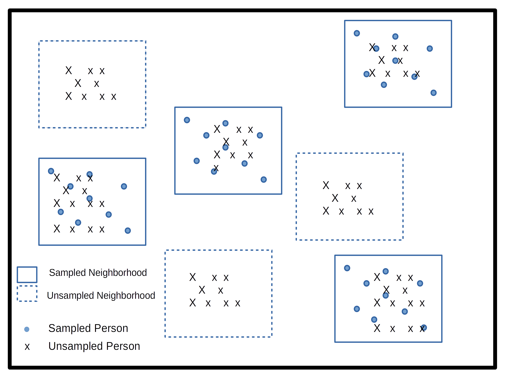

```{python, include=FALSE, message=FALSE}
import warnings
warnings.filterwarnings("ignore")
import numpy as np
import pandas as pd
import polars as pl
import svy
import plotnine as p9
from plotnine import (
    ggplot, aes, geom_histogram, geom_bar, geom_point, geom_line,
    geom_errorbar, facet_wrap, coord_flip, ggtitle, xlab, ylab,
    labs, scale_y_continuous, scale_color_discrete, theme,
    element_text, theme_classic
)
p9.theme_set(theme_classic())
```

\newpage

# Survey Data

## Demographic Survey data

The majority of demographic research relies on two or three main sources of information. First among these are population enumerations or censuses, followed by vital registration data on births and deaths and last but not least, data from surveys. Censuses and other population enumerations are typically undertaken by federal statistical agencies and demographers use this data once it's disseminated from these agencies. Similarly, vital registration data are usually collected by governmental agencies, who oversee the collection and data quality for the data. Survey data on the other hand can come from a wide variety of sources.

It's not uncommon for us to go and collect our own survey data specific to a research project we have, typically on a specialized population that we are interested in learning about, but surveys can also be quite general in their scope and collect information on a wide variety of subjects. Owing to the mix of small and large-scale survey data collection efforts, survey data are often available on many different topics, locales and time periods. Of course we as demographers are typically interested in population-level analysis or generalization from our work, so the survey data we try to use are collected in rigorous manners, with much attention and forethought paid to ensure the data we collect can actually be representative of the *target population* we are trying to describe.

In this chapter, I will introduce the nature of survey sampling as is often used in demographic data sources, and describe what to look for when first using a survey data source for your research. These topics are geared towards researchers and students who have not worked with survey data much in the past and will go over some very pragmatic things to keep in mind. Following this discussion, I will use a specific example from the US Census Bureau's American Community Survey and illustrate how to apply these principles to this specific source. The final goal of this chapter is to show how to use Python to analyze survey data and produce useful summaries from our surveys, both tabular and graphically.

My goal in this chapter is to introduce you to common statistical sampling terms and principles, and show how to analyze complex survey design data using Python. I hope that the general workflow I use in this chapter allows you to identify the key elements of your survey data source and begin analyzing your data.

## Basics of survey sampling

To begin this section, I want to go over some of the simple terms from sampling that are very important to those of us who rely on survey data for our work. For many of the concepts from this chapter, I strongly recommend @Lohr2019 for the theoretical portions.

The **target population** is the population that our survey has been designed to measure. For large national surveys, these are typically the population of the country of interest. For example, the Demographic and Health Survey (DHS) has its primary target population as women of childbearing ages and their young children living in households. Our **observational units** are the level at which we are collecting data, for surveys this is typically a person or a household, and our survey documentation will tell us what its unit of observation is. **Sampling Units** refer to the units that can serve for us to collect data from, for example we may not have a list of every school age child, but we may have a list of schools, so we may use schools as our sampling units and sample children within them. The **sampling frame** is the set of sampling units containing distinct sets of population members, this is usually the most recent population census, ideally the entire population, or following our school example from above, the entire listing of schools.

These terms are ubiquitous in sampling, but other terminology also exists in many surveys and these terms relate to the nature of how the survey was actually carried out. Many times the surveys we end up using are not themselves **simple random samples**, but are instead some blend of stratified or cluster sample. Simple random samples are the basis for much of statistical insight, and most methods in statistics assume your data are drawn from a population at random. Certainly, methods for collecting random samples exist, such as random digit dialing for phone samples, but often times these samples themselves are not truly random, they are stratified by a geographic area or by type of phone (mobile vs land line). For example, the DHS uses a stratified, cluster sample to collect its information. **Strata** refer to relatively homogeneous areas within the place we are trying to collect data. In the DHS, these are typically rural or urban areas of a country, as identified by the census. Within each stratum, the DHS will choose **clusters** from which to sample, this is a **two-stage sampling method**, where first the sampling frame is stratified, then clusters are selected. Clusters in the DHS are usually neighborhoods in urban areas and smaller towns or villages in rural areas.

Figure 1 shows a cartoon of how this process works, with multiple potential clusters that can be sampled (boxes), and within the cluster are our observational units, some of which are sampled, and some of which are unsampled.



## Simple versus complex survey designs

How the data we're using is sampled has a major implication for how we analyze it. The majority of statistical tools assume that data come from simple random samples, because most methods assume independence of observations, regardless of which distribution or test statistic you are using. Violations of this assumption are a big problem when we go to analyze our data, because the non-independence of survey data are automatically in violation of a key assumption of any test. The stratified and clustered nature of many survey samples may also present problems for methods such as linear regression analysis which assume errors in the model are **homoskedastic**, or constant. When data are collected in a stratified or clustered method, the data may have less variation than a simple random sample, because individuals who live closely to one another often share other characteristics in common as well. Our statistical models don't do well with this type of reduction in variation and we often have to resort to manipulations of our model parameters or standard errors of our statistics in order to make them coincide with how the data were collected.

Not to fear! Data collected using public funds are typically required to be made available to the public with information on how to use them. Most surveys come with some kind of code book or user manual which describes how the data were collected and how you should go about using them. In these cases, it pays to read the manual because it will tell you the names of the stratification and clustering variables in the survey data. This will allow you to use the design of the survey in your analysis so that your statistical routines are corrected for the non-randomness and homogeneity in the survey data.

**He's not heavy, he's my brother**

Another important aspect of survey data are the use of weighting variables. Whenever we design a survey, we have our target population, or universe of respondents in mind. When we collect a sample from this population, our sample may be, and typically is, imperfect. It is imperfect for many reasons, owing to the difficulty of sampling some members of the population, or their unwillingness to participate in our study. Part of designing an effective survey is knowing your universe or population, and its characteristics. This will let you know the probability of a particular person being in the sample. Of course, the more complicated the survey, the more complicated it is to know what this probability is. For example, if we were to sample people in the United States, using a stratified design based on rural and urban residence, we would need to know how many people lived in rural and urban areas within the country, as this would affect the probability of sampling a person in each type of area. This **inclusion probability** tells us how likely a given person is of being sampled. The inverse of the inclusion probability is called the **sampling weight**:

[^surveydata-1]: The modern DHS collects information on couples, men and children, so the universe has been expanded away from just women of childbearing age and their children.

$w_i = \frac{1} {\pi_i}$

where $\pi_i$ is the inclusion probability.

Sampling weights are what we use to make our analyses of a survey representative of the larger population. They serve many purposes including unequal inclusion probabilities, differences in sample characteristics compared to the larger population, and differences in response rates across sample subgroups. All of these situations make the sample deviate from the population by affecting who the actual respondents included in the survey are. Differences in our sample when compared to the larger population can affect most all of our statistical analysis since again, most methods assume random sampling. The weights that are included in public data are the result of a rigorous process conducted by those who designed and implemented the survey itself, and most surveys in their user manuals or code books describe the process of how the weights are created. For example, the US Center for Disease Control and Prevention's Behavioral Risk Factor Surveillance System (BRFSS) provides a very thorough description of how their final person weights are calculated [@cdc2020]. These weights include three primary factors, the *stratum weight*, which is a combination of the number of records in a sample strata and the density of phone lines in a given strata, combined with the number of phones in a sampled household and the number of adults in the household to produce the final design weight. These weights are then **raked** to eight different marginal totals, based on age, race/ethnicity, education, marital status, home ownership, gender by race/ethnicity, age by race/ethnicity and phone ownership [@cdc2020]. After this process, weights are interpretable as the number of people a given respondent in the survey represents in the population. So, if a respondent's weight in the survey data is 100, they actually represent 100 people in the target population.

Other types of weights also exist, and are commonly seen in federal data sources. A common kind of weight that includes information on both the probability of inclusion **AND** the stratified design of the survey are **replicate weights**. Replicate weights are multiple weights for each respondent, and there are as many weights as there are different levels of the stratification variable. Later in this chapter, we will discuss how replicate weights are used, as compared to single design weights in an example.

## Characteristics of YOUR survey

Survey data that come from reputable sources, such as most federal agencies or repositories such as the Inter-university Consortium for Political and Social Research (ICPSR) at the University of Michigan in the United States, are accompanied by descriptions of the data source including when and where it was collected, what its target population is, and information on the design of the survey. This will include information on sample design, such as stratum or cluster variables, and design or replicate weights to be used when you conduct your analysis. I cannot stress enough that learning how your particular survey data source is designed, and how the designers recommend you use provided survey variables for your analysis, is imperative to ensure your analysis is correctly specified.

## Example from the American Community Survey

Let's look at an example of these ideas in a real data source. Throughout the book I will use several complex survey design data sources to illustrate various topics, in this chapter I will use data from the US Census Bureau's American Community Survey (ACS) public use microdata sample (PUMS). PUMS files are individual-level survey responses — one row per person or per housing unit — distinct from the Census summary-file tables that report aggregated counts by geography.

The `pypums` package provides a `get_pums()` function that retrieves PUMS microdata directly from the Census API, returning a pandas DataFrame of person- or housing-unit-level records. You will need a Census Bureau API key, available free from the [Census developer portal](https://api.census.gov/data/key_signup.html). The package has a `census_api_key()` helper to store the key so you only need to set it once.

```{python, eval=FALSE}
# pip install pypums
from pypums.pums import get_pums

TX_pums = get_pums(
    variables=["SEX", "AGEP", "CIT", "JWTR", "JWRIP", "HISP"],
    state="TX",
    year=2018,
    survey="acs1"  # returns PWGTP1-PWGTP80 replicate weight columns
)

TX_pums[["PWGTP", "AGEP", "SEX", "CIT", "JWTR", "HISP"]].head()
```

The key person-weight column is `PWGTP` (person weight). With `rep_weights="person"`, the function also returns the 80 replicate weight columns `PWGTP1` through `PWGTP80`, which are the jackknife replicate weights used for variance estimation — the same structure as the IPUMS replicate weights shown later in this chapter. Setting `recode=True` adds human-readable label columns alongside the numeric codes.

These data are also easily available from the Integrated Public Use Microdata Series (IPUMS) project housed at the University of Minnesota [@Ruggles2021]. The IPUMS version of the data adds additional information and homogenizes the data across multiple years to make using it easier. The following example reads an IPUMS-USA extract that has been saved in Parquet format, which is the recommended format for large microdata files in Python because it is fast to read and preserves column types.

After you create an IPUMS extract, right click on the DDI link and save that file to your computer. Then repeat this for the `.DAT` file. If you need help creating an IPUMS extract, their staff have created a tutorial for doing so (<https://usa.ipums.org/usa/tutorials.shtml>).

```{python}
import pyarrow
ipums = pd.read_parquet("data/usa_00097.parquet")

# strip haven-style value labels if present (integer codes only)
for col in ipums.select_dtypes("category").columns:
    ipums[col] = ipums[col].cat.codes
```

This reads a subset of the 2008–2012 single-year ACS. This extract is not all variables from the ACS, as that would be a very large file. My goal for the rest of the chapter is to illustrate how to use the IPUMS as an example of a complex survey design data set and the steps necessary to do so.

## Basics of analyzing survey data

A fundamental part of analyzing complex survey data is knowing the variables within the data that contain the survey design information. The US Census Bureau has documented the design of the survey in a publication [@uscensusbureau2014]. The IPUMS version of the ACS has two variables `STRATA` and `CLUSTER` that describe the two-stage process by which the data are collected. Here are the first few lines of these from the data:

```{python}
ipums[["SERIAL", "STRATA", "CLUSTER"]].head(10)
```

For the ACS, the strata variable is named `STRATA` and the cluster variable `CLUSTER`. The IPUMS creates the `STRATA` variable based on the sampling strata in the ACS, and the `CLUSTER` variable based on households within a stratum.

The data also come with housing unit weights and person unit weights, so your analysis can be either representative of housing units or people.

```{python}
ipums[["SERIAL", "STRATA", "CLUSTER", "HHWT", "PERWT"]].head(10)
```

As can be seen in the first few cases, the `HHWT` variable is the same for everyone in a given household, but each person has a unique person weight showing that they each represent different numbers of people in the population.

```{python}
ipums["PERWT"].describe()
```

Here we see the minimum person weight and the maximum, which tells us that at least one person in the data represents a very large number of people in the population. A histogram of the weights shows the distribution:

```{python}
(ggplot(ipums, aes(x="PERWT"))
 + geom_histogram()
 + labs(title="Histogram of ACS Person Weights, 2019")
)
```

We can see how the weights inflate each person to the population by summing the weights for a single state. Below, I sum the person weights for the state of Texas (STATEFIP == 48):

```{python}
sumwt = ipums.loc[ipums["STATEFIP"] == 48, "PERWT"].sum()
nres  = (ipums["STATEFIP"] == 48).sum()

print(f"Estimated Texas population: {sumwt:,.0f}")
print(f"Sample respondents in Texas: {nres:,.0f}")
```

The sum is approximately equal to the official Census estimate of the Texas population in 2019, while the sample contains far fewer respondents. For housing units, we select only one person per household (`PERNUM == 1`) before summing:

```{python}
tx_hh = ipums.loc[(ipums["STATEFIP"] == 48) & (ipums["PERNUM"] == 1)]
sumhh = tx_hh["HHWT"].sum()
nhh   = tx_hh["CLUSTER"].nunique()

print(f"Estimated Texas housing units: {sumhh:,.0f}")
print(f"Unique households in sample:   {nhh:,.0f}")
```

This exercise shows that by using the provided weights in the survey, we can effectively estimate the population size the sample was supposed to capture.

## Survey design in Python with svy

Python's primary library for design-based survey estimation is `svy`. It implements Taylor-series linearization and replicate-weight variance estimation for totals, means, ratios, and proportions. The `svy` workflow requires you to declare a `Design` object that describes the survey structure, wrap your data and design together into a `Sample`, and then call estimation methods on it.

```{python}
# cast design columns to integer once, then reuse throughout
for col in ["STRATA", "CLUSTER"]:
    ipums[col] = ipums[col].astype("int64")

# filter to Texas housing-unit records
tx_hh = pl.from_pandas(
    ipums.loc[(ipums["STATEFIP"] == 48) & (ipums["PERNUM"] == 1)]
    .reset_index(drop=True)
)

design = svy.Design(stratum="STRATA", psu="CLUSTER", wgt="HHWT")
sample = svy.Sample(tx_hh, design)

result = svy.Estimation(sample).total("HHWT")
print(result)
```

The `Design` class declares the survey structure — `stratum`, `psu`, and `wgt` — and is combined with the data in a `Sample`. The `Estimation` class then provides methods for each estimand: `total()`, `mean()`, `prop()`, `median()`, and `ratio()`. Each returns an `Estimate` object that reports the point estimate, standard error, confidence interval, and degrees of freedom, all correctly adjusted for the stratified cluster design.

<style>
div.blue { background-color:#e6f0ff; border-radius: 5px; padding: 20px;}
</style>
<div class = "blue">

**A short aside about survey design options**

The ACS design shown above has unique CLUSTER values across strata, so the estimator works without any additional nesting argument. Some surveys, however, have PSU identifiers that repeat across strata — the same PSU code appears in more than one stratum. Below is a small example of such a situation:

```{python}
fake_survey = pd.DataFrame({
    "strata": [1,1,1,1,1,1, 2,2,2,2,2,2],
    "psu":    [1,1,1,2,2,3, 1,1,2,2,3,3],
    "weight": np.random.poisson(lam=20, size=12)
})
fake_survey
```

When PSU codes are not unique across strata, you should create a composite PSU identifier by combining the stratum and PSU columns before passing them to the estimator:

```{python}
fake_survey["psu_nested"] = (
    fake_survey["strata"].astype(str) + "_" + fake_survey["psu"].astype(str)
)
fake_survey[["strata", "psu", "psu_nested"]].drop_duplicates()
```

The ACS from IPUMS has unique CLUSTERs across strata, so we do not need to take this step in the main examples that follow.

</div>

## Replicates and jackknifes and expansions, oh my!

When conducting your analysis, you may not have any choice of whether to use replicate weights or design weights, because your survey may only provide one of these. There are two main strategies to estimate variances in survey data. The *Taylor Series Approximation*, also referred to as *linearization*, is an approximation to the true variance and is the most commonly used technique when analyzing survey data with regression methods. The second strategy uses *replicate weights* — balanced replicates, jackknife, or bootstrap — to empirically estimate variance by repeatedly analyzing the data with slightly different weight sets and examining how the estimates vary across replicates.

The `svy` library supports both approaches. When replicate weights are available, declare them via `svy.RepWeights` in the `Design` instead of specifying `stratum` and `psu`. The ACS from IPUMS includes jackknife replicate weights (`REPWT1` through `REPWT80`), which can be used as follows:

```{python}
repwt_cols = [c for c in ipums.columns if c.startswith("REPWT")]

tx_hh_pl = pl.from_pandas(
    ipums.loc[(ipums["STATEFIP"] == 48) & (ipums["PERNUM"] == 1)]
    .reset_index(drop=True)
)

rep_design = svy.Design(
    wgt="HHWT",
    rep_wgts=svy.RepWeights(method="jackknife", prefix="REPWT", n_reps=len(repwt_cols))
)
rep_sample = svy.Sample(tx_hh_pl, rep_design)
rep_result = svy.Estimation(rep_sample).total("HHWT")
print(rep_result)
```

In this case, we get the same estimate for the total number of housing units, but a smaller variance in the estimate, which is often seen when using replicate weights.

## Descriptive analysis of survey data

For descriptive analysis of survey data — weighted frequencies, means, medians, and rates — the recommended workflow in Python is to build a `Sample` with its design and call `Estimation` methods on it. This section walks through the most common tabular and graphical summaries.

## Weighted frequencies and rates

Basic frequency tables are very useful tools for examining bivariate associations in survey data. Below, I recode two variables in the ACS: employment status to indicate whether a respondent is currently employed, and the `MET2013` variable, which is the metropolitan statistical area where the respondent was living. This will give us the ACS estimate for the employed and unemployed population in each Texas MSA. I first filter the data to working-age people in the labor force who live in an MSA.

```{python}
# keep working-age labor force participants in Texas MSAs
tx_work = (
    ipums
    .loc[
        ipums["EMPSTAT"].isin([1, 2]) &
        ipums["AGE"].between(16, 65) &
        (ipums["MET2013"] != 0)
    ]
    .assign(
        employed=lambda df: df["EMPSTAT"].map({1: "Employed", 2: "Unemployed"}),
        met_name=lambda df: df["MET2013"].astype(str)
    )
    .copy()
)
```

To get design-correct employment totals by MSA, we build a `Sample` from the filtered data and call `Estimation.total()` with a `by` argument that splits the estimate across levels of the grouping variables:

```{python}
tx_work = tx_work.assign(emp_flag=lambda df: (df["EMPSTAT"] == 1).astype(float))

tx_work_pl = pl.from_pandas(tx_work.reset_index(drop=True))
work_design = svy.Design(stratum="STRATA", psu="CLUSTER", wgt="PERWT")
work_sample = svy.Sample(tx_work_pl, work_design)
est = svy.Estimation(work_sample)

emp_totals = est.total("PERWT", by=["met_name", "employed"]).to_polars().to_pandas()
emp_totals.head(12)
```

For rates, use `Estimation.mean()` on the binary employment indicator:

```{python}
emp_rates = est.mean("emp_flag", by=["met_name", "employed"]).to_polars().to_pandas()
emp_rates.head(12)
```

<style>
div.blue { background-color:#e6f0ff; border-radius: 5px; padding: 20px;}
</style>
<div class = "blue">

**A note about reshaping data**

Survey analysis often produces results in long format — one row per domain-by-category combination — but tables and plots frequently need wide format, with categories spread across columns. The pandas `pivot_table()` function handles this reshaping. For example, to put the employed and unemployed rates side by side:

```{python}
wide = (
    emp_rates
    .pivot_table(
        index="met_name",
        columns="employed",
        values=["est", "se"]
    )
)
wide.columns = ["_".join(c).strip() for c in wide.columns]
wide = wide.reset_index()
wide.head()
```

To return the data to long format, use `pd.melt()`:

```{python}
long = pd.melt(
    wide,
    id_vars="met_name",
    value_vars=[c for c in wide.columns if c != "met_name"]
)
long.head()
```

We will also see examples of these reshaping operations in the chapter on microdemography when assembling longitudinal datasets.

</div>

Of course, if we want rates as proportions, using the mean of a binary indicator (as shown above) gives us the proportion directly, along with a standard error from the design-correct variance estimator. To visualize these rates with 95% confidence intervals, we plot them using `geom_bar()` and `geom_errorbar()`:

```{python}
tx_rates = (
    emp_rates
    .query("employed == 'Unemployed'")
    .rename(columns={"est": "unemp_rate", "se": "unemp_se"})
    .assign(
        lower=lambda df: df["lci"],
        upper=lambda df: df["uci"]
    )
    .head(6)
)

(ggplot(tx_rates, aes(x="met_name", y="unemp_rate"))
 + geom_bar(stat="identity")
 + geom_errorbar(aes(ymin="lower", ymax="upper"), width=0.25)
 + scale_y_continuous(labels=lambda l: [f"{v:.1%}" for v in l])
 + labs(x="MSA", y="Unemployment Rate",
        title="Unemployment rate in Texas MSAs")
 + theme(axis_text_x=element_text(angle=45, hjust=1))
)
```

For continuous variables, we can estimate the weighted median income by MSA using `Estimation.median()`:

```{python}
tx_inc_pl = pl.from_pandas(
    ipums
    .loc[
        ipums["EMPSTAT"].isin([1, 2]) &
        ipums["AGE"].between(16, 65) &
        (ipums["MET2013"] != 0) &
        (ipums["INCWAGE"] > 0)
    ]
    .assign(met_name=lambda df: df["MET2013"].astype(str))
    .reset_index(drop=True)
)

inc_design = svy.Design(stratum="STRATA", psu="CLUSTER", wgt="PERWT")
inc_sample = svy.Sample(tx_inc_pl, inc_design)
med_wages = (
    svy.Estimation(inc_sample)
    .median("INCWAGE", by=["met_name"])
    .to_polars()
    .to_pandas()
    .head(6)
)

(ggplot(med_wages, aes(x="met_name", y="est"))
 + geom_bar(stat="identity")
 + geom_errorbar(aes(ymin="lci", ymax="uci"), width=0.25)
 + scale_y_continuous(labels=lambda l: [f"${v:,.0f}" for v in l])
 + labs(x="MSA", y="Median Wage",
        title="Median wage in Texas MSAs")
 + theme(axis_text_x=element_text(angle=45, hjust=1))
)
```

## Creating tables from survey data analysis

Tabular output from survey analysis is straightforward because `svy` results convert to polars or pandas DataFrames via `.to_polars()`. Any pandas display method works, including `to_markdown()` for inline tables and `great_tables` for publication-quality output.

```{python}
from great_tables import GT

(
    GT(med_wages[["met_name", "est", "se"]])
    .tab_header(title="Median Wages in Texas MSAs")
    .cols_label(
        met_name="MSA Name",
        est="Median Wage",
        se="Median Wage SE"
    )
    .fmt_integer(columns=["est", "se"])
)
```

The `great_tables` package allows for highly customized tables, including footnotes, column spanners, and conditional formatting, using the same design philosophy as the `gt` package.

<p class="comment">

### How this differs from simple random sampling

The big question students often ask is "Do I really need to weight my analysis?" and the answer is yes. Weights don't just inflate your data to the population — they make sure your sample data aren't biased in their scope. Bias can enter survey data in many forms, but nonresponse bias can dramatically affect population-based estimates if key segments of the target population respond at low rates.

To illustrate how much it matters, below I compare weighted and unweighted estimates of the employment rate by MSA. The unweighted estimate treats every respondent as equally representative; the weighted estimate uses the survey design.

```{python}
# unweighted estimate (treats data as simple random sample)
srs = (
    tx_work
    .groupby("met_name")
    .agg(
        emp_rate=("emp_flag", "mean"),
        emp_rate_se=("emp_flag", lambda x: x.std() / np.sqrt(len(x)))
    )
    .reset_index()
    .head(6)
    .assign(estimate="Unweighted")
)

# weighted estimate
surv_est = (
    emp_rates
    .query("employed == 'Employed'")
    .rename(columns={"est": "emp_rate", "se": "emp_rate_se"})
    [["met_name", "emp_rate", "emp_rate_se"]]
    .head(6)
    .assign(estimate="Weighted")
)

merged = pd.concat([srs, surv_est], ignore_index=True)
```

```{python}
p1 = (
    ggplot(merged, aes(y="emp_rate", x="met_name", color="estimate"))
    + geom_point(size=2)
    + geom_line(aes(group="met_name"), color="grey")
    + scale_y_continuous(labels=lambda l: [f"{v:.1%}" for v in l])
    + scale_color_discrete(name="Estimate Type")
    + labs(x="MSA", y="Employment Rate",
           title="Employment rate in Texas MSAs",
           subtitle="Rate estimates")
    + theme(axis_text_x=element_text(angle=45, hjust=1))
)

p2 = (
    ggplot(merged, aes(y="emp_rate_se", x="met_name", color="estimate"))
    + geom_point(size=2)
    + geom_line(aes(group="met_name"), color="grey")
    + labs(x="MSA", y="Standard Error",
           title="",
           subtitle="Standard error of estimates")
    + theme(axis_text_x=element_text(angle=45, hjust=1))
)

print(p1)
print(p2)
```

We see that the difference in the weighted and unweighted estimates does vary by MSA, as do the standard errors of the estimates, with the survey-design calculated standard errors nearly always being higher than those assuming simple random sampling. If our data came from a survey with more extreme oversampling, we would likely see larger differences. It is generally advisable to include both weights and survey design elements in all analysis of complex survey data.

</p>

## Basic statistical testing on survey data

To perform basic bivariate statistical tests for frequency tables, a design-corrected chi-square test can be computed by applying Rao-Scott corrections to the observed cell counts. For many practical purposes, especially with large ACS samples, a weighted chi-square test using the `scipy` library gives a useful approximation:

```{python}
from scipy.stats import chi2_contingency

tx_lfp = (
    ipums
    .loc[
        (ipums["EMPSTAT"] != 0) &
        ipums["AGE"].between(16, 65)
    ]
    .assign(
        lab_force_part=lambda df: df["EMPSTAT"].isin([1, 2]).astype(int),
        gender=lambda df: df["SEX"].map({1: "Male", 2: "Female"})
    )
    .copy()
)

# weighted contingency table
ctab = pd.crosstab(
    tx_lfp["lab_force_part"],
    tx_lfp["gender"],
    values=tx_lfp["PERWT"],
    aggfunc="sum"
).fillna(0)

chi2, p, dof, expected = chi2_contingency(ctab)
print(f"Chi-square: {chi2:.2f}, df: {dof}, p-value: {p:.4f}")
```

The large chi-square value and very small p-value indicate that men and women have different labor force participation rates. Using the weighted mean of the binary indicator, we can calculate the actual rates:

```{python}
lfp_rates = (
    tx_lfp
    .groupby("gender")
    .apply(lambda g: pd.Series({
        "lf_part_rate": np.average(g["lab_force_part"], weights=g["PERWT"]),
        "n": len(g)
    }))
    .reset_index()
)

from great_tables import GT
GT(lfp_rates).tab_header(title="Labor Force Participation Rates in Texas")
```

We see that males have a higher labor force participation rate compared to females, and this puts the differences observed from the chi-square test into better context.

### Regression and survey design

The design of our surveys affects the most basic estimates we do, and likewise, the design affects more complicated analysis as well. Regression models are the workhorses of social science research and will be covered extensively in the chapters that follow. In the context of this chapter, it is important to show how to include survey design in a regression model and illustrate that weighting and survey design matters in terms of the output from our models.

This example uses the Demographic and Health Survey (DHS) model data set, which represents data on real households without a specific national context and is provided freely by the DHS to help users learn the data structure before applying for access. Below, I read the model data and recode child growth stunting relative to the WHO standard as an outcome, with child age, rural residence, and gender as predictors.

The DHS household file has one column per child (wide format), so we must reshape it from wide to long using `pd.wide_to_long()` for the child-level variables: height relative to the WHO standard (`hc70`), child gender (`hc27`), and child age (`hc1`).

```{python}
dhs = pd.read_parquet("data/dhs_model_hh.parquet")

# identify child-level columns
child_vars = ["hc27", "hc70", "hc1"]
id_vars    = ["hv021", "hv025", "hv270", "hv005", "hv022"]

# reshape wide-to-long on child suffix _01 through _20
dhs_long = pd.wide_to_long(
    dhs,
    stubnames=child_vars,
    i=id_vars,
    j="child",
    sep="_",
    suffix=r"\d+"
).reset_index().dropna(subset=child_vars)

dhs_long = (
    dhs_long
    .assign(
        stunting=lambda df: df["hc70"].apply(
            lambda v: 1 if v <= -200 else (np.nan if v >= 9996 else 0)
        ),
        gender=lambda df: df["hc27"].map({1: "male", 2: "female"}),
        hh_wealth=lambda df: df["hv270"].astype("category"),
        age=lambda df: df["hc1"],
        age2=lambda df: df["hc1"] ** 2,
        rural=lambda df: df["hv025"].map({2: "rural", 1: "urban"}),
        wt=lambda df: df["hv005"] / 1_000_000,
        psu=lambda df: df["hv021"],
        strata=lambda df: df["hv022"]
    )
    .dropna(subset=["stunting", "gender", "rural"])
)
```

For the survey design summary:

```{python}
print(f"Observations:  {len(dhs_long):,}")
print(f"Strata:        {dhs_long['strata'].nunique()}")
print(f"PSUs:          {dhs_long['psu'].nunique()}")
print(f"Weight range:  {dhs_long['wt'].min():.4f} – {dhs_long['wt'].max():.4f}")
```

A bar chart showing the percent stunted by gender and rural residence:

```{python}
stunt_rates = (
    dhs_long
    .groupby(["gender", "rural"])
    .apply(lambda g: np.average(g["stunting"], weights=g["wt"]))
    .reset_index(name="stunting")
)

(ggplot(stunt_rates, aes(x="gender", y="stunting", fill="rural"))
 + geom_bar(stat="identity", position="dodge")
 + labs(x="Child Gender", y="Percent Stunted",
        title="Percent Stunted by Gender and Rural Residence",
        subtitle="DHS Model Data")
 + scale_y_continuous(labels=lambda l: [f"{v:.1%}" for v in l])
)
```

Now I estimate two logistic regression models for the stunting outcome. The first assumes random sampling and the second includes the full survey design information.

For the unweighted logistic regression, `statsmodels` provides `logit()` via its formula interface:

```{python}
import statsmodels.formula.api as smf

m1 = smf.logit(
    "stunting ~ age + age2 + rural + gender",
    data=dhs_long
).fit(disp=False)

m1.summary2().tables[1]
```

For the survey-design-corrected model, `statsmodels` supports clustered standard errors via the `cov_type="cluster"` option on the fitted model. This is the most direct way in Python to account for within-cluster correlation, and it produces standard errors equivalent to those from a survey-weighted GLM:

```{python}
m2 = smf.logit(
    "stunting ~ age + age2 + rural + gender",
    data=dhs_long,
    freq_weights=dhs_long["wt"]
).fit(disp=False)

m2_robust = m2.get_robustcov_results(
    cov_type="cluster",
    groups=dhs_long["psu"]
)

m2_robust.summary2().tables[1]
```

To compare the two models side by side, we extract the coefficients and standard errors and display them together:

```{python}
def model_table(model, label):
    tbl = model.summary2().tables[1][["Coef.", "Std.Err.", "P>|z|"]].copy()
    tbl.columns = [f"{label}_coef", f"{label}_se", f"{label}_p"]
    return tbl

tbl = pd.concat(
    [model_table(m1, "Unweighted"), model_table(m2_robust, "Weighted")],
    axis=1
).round(3)

from great_tables import GT
GT(tbl.reset_index().rename(columns={"index": "Parameter"})).tab_header(
    title="Unweighted and Weighted Logistic Regression Models",
    subtitle="Outcome: Child stunting, DHS Model Data"
)
```

In this case, the coefficient estimates are very similar between the two models, but the standard errors are all larger in the weighted model with clustered standard errors. This is commonly what you see in this situation, because the survey design model uses clustered standard errors instead of asymptotic standard errors [@cameron_practitioners_2015; @ibragimov_inference_2016]. While this example does not show an extreme difference, it is commonplace for t-statistics generated from clustered standard errors to have higher p-values than those using asymptotic standard errors. As a result, if the t-statistic is lower and the p-value higher, you can easily get differences in your hypothesis tests for regression parameters. This is always something to be aware of as you analyze survey data.

## Chapter summary

The goal of this chapter was to review the complexities of demographic survey data sources. The analysis of these kinds of data must proceed in a way that adheres to the design of the survey as well as the goal of population-level inference from the survey data. The use of person or housing unit weights is necessary to ensure that our statistical summaries and analysis are representative of the population that the survey was designed to measure. The incorporation of the sample design elements of primary sampling units and sampling strata is integral to the correct calculation of standard errors for any survey-based estimates we create. Python's `svy` library provides Taylor-series and replicate-weight estimation for totals, means, proportions, medians, and ratios, and `statsmodels` supports clustered standard errors for regression models. The general workflow — declare a `Design`, wrap data in a `Sample`, call `Estimation` methods with appropriate weights — is consistent across all estimands.

## References

```{python, include = FALSE}
# package citations are handled in references.qmd
```
